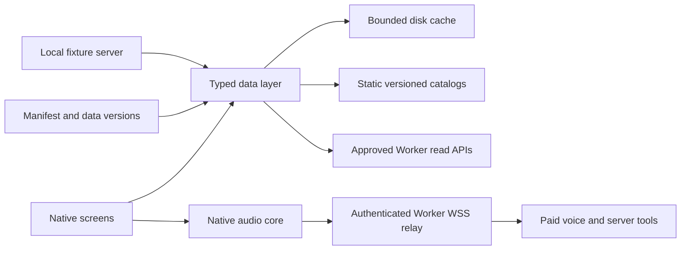

# OPAX iOS: data, API contract and native architecture

Research snapshot: 3 October 2026. Source baseline: `8f1305e383b2f20c2a2fe879e550bd5b7414b8cc` on `ios/app`. This document describes the existing Worker and published data, then proposes changes for review. There is no mobile implementation at this baseline. Product journeys and visual design belong in the separate iOS UX discovery.

**V1 scope is read-only public data plus the voice assistant.** Public reading works signed out; only voice requires the existing community email account. Community discussions, member follows, follows sync and push stay hidden and out of v1. In-app account deletion is a v1 release blocker. The voice implementation and proposed code/header session are in the companion [IOS-VOICE.md](IOS-VOICE.md), inspected on branch `ios/discovery-voice` at `0ad9c7de` and still under review. This contract adds the API/session comparison; the companion document needs reconciliation if the cookie recommendation below is accepted.

Bills, people, votes, pay, interests, electorate references and discovery leads have static exports. V1 search uses catalog-only `/api/search-all` with an explicit catalog kind such as `person`, excluding `bill`, `all` and document kinds. The native client never calls Ask, `/api/search`, search-summary, follow-ups, journey-story, brief or `/og/*`. Other ARAG-backed record/aggregate routes below are an inventory of the web, not a v1 client allowlist. Voice tools may reach ARAG server-side under the paid voice capability. `mode=keyword` does not make document search cost-free.

The app draws its own share previews from already loaded data and licensed portraits. It must not fetch `/og/*`, including indirectly through LinkPresentation / `LPMetadataProvider` fetching a shell's `og:image`. Fixtures should reject that request path and automatic remote link-metadata fetches.

## Evidence and limits

Source inspection covered [the entry point](../portal/src/index.ts), its community, auth, social, notification, voice, MCP, bill-text and network-block dispatches, the web loaders, static exports, refresh scripts and deployment configuration. Route coverage was checked by extracting path literals and regular-expression dispatches from those files, then reconciling them with `matchSeoRoute`, `STATIC_PAGES`, directory kinds, staging dispatch and the asset fallback. The inventory below includes internal transport and operator routes as well as app candidates. It is a source contract, not a claim that every branch is enabled in production.

Local size measurements were made in this discovery worktree at **2026-10-03 04:31:52 UTC** against the baseline above. Raw means file bytes. Gzip means each file compressed separately with a streaming gzip wrapper at level 6, without filename metadata, then summed. These estimates exclude HTTP headers, TLS, app binaries, JavaScript and CSS unless explicitly listed. Already compressed images should use their raw size. Catalog-family measurements and journey sums are kept outside the repository. Gzip-6 budgets are conservative planning upper bounds for the sampled static journeys, not promises about a negotiated wire encoding; production can serve Brotli (`br`).

Production measurements used **24 sequential requests** to `https://opax.com.au`, between **04:32:44 and 04:34:45 UTC on 3 October 2026**, with User-Agent `opax-ios-discovery (read-only)`. All were verified static reads, `/api/person-slugs`, `/today`, a conditional static GET, or the headers-only `/corpus.json` request. Curl's `size_download` measures transferred response-body bytes; decoded JSON was checked for shape. No browser, analytics, model, ARAG, voice, email, sign-in, social publication or OG route was exercised. Production samples do not prove that the entire live deployment matches this commit. Request journals, headers and sampled bodies are kept outside the repository.

The independent review supplied **seven further sequential production GETs at 04:58:04 to 04:58:05 UTC on 3 October 2026**, with User-Agent `opax-ios-review (read-only)`. With `br` advertised, `/parliamentarians.json` transferred **36,935 Brotli bytes** and `/bills/index.json` **108,140 Brotli bytes**, against local gzip-6 sizes **37,766** and **132,287** respectively. The review also checked electorate/search manifests, person-slugs, corpus and AASA (404). This fix round made **zero new OPAX production requests** and no voice, community or paid calls in any environment.

`portal/node_modules` was absent. No dependency install, build, Wrangler process, simulator, remote database operation or deployment was needed. No paid-route response size or authenticated runtime behavior was measured. Where a total includes such calls, the unknown component is stated rather than estimated.

## Shared request rules

Unless a row says otherwise, a public API has no user authentication, no CORS response headers, and JSON errors of the form `{error: string}`. There is no general API `OPTIONS` handler. Community, voice and MCP responses force `Cache-Control: no-store` and `Referrer-Policy: no-referrer`. Unknown `/api/*` paths return JSON 404. Wrong methods generally fall through to 404, with explicit 405 handling in bill-text, social and transport branches.

The following shorthand applies to every route row:

Cost classes are **free static**, **cheap read**, **D1 read/write**, **model generation**, **paid third party** and **render: Worker CPU plus possible ARAG, O60**. References below to a "model-service read" or "model-backed retrieval" use the paid-third-party class for the ARAG service boundary, distinguishing them from an answer-writing generation. This is a dependency classification, not measured marginal billing; caches and provider arrangements can change actual cost. OG has its own render class: WASM rasterization on every cache miss, plus possible ARAG reads for `/og/doc/*` and story recomposition. A cached response does not make OG a cheap-read capability. The inspected Wrangler configuration binds ASSETS, generation-cache KV, community D1 and the email sender; it declares no AI or R2 binding. Remote model work here uses the ARAG HTTP service and its configured writer slots.

| Code | Meaning at the inspected baseline |
| --- | --- |
| `N` | `/api/*`, `/og/*` and `/bill-texts/*` are rejected for `BLOCKED_ASNS`, configured as 45102, 24429 and 37963. Rejection is 403 `{error:'forbidden',reason:'network'}`, no-store. |
| `G` | In addition to `N`, only `/api/ask`, `/api/search-summary`, `/api/followups` and `/api/journey-story` apply generation blocks: ASN 32934; IPv4 ranges `116.179.32.0/21`, `220.181.108.0/24`, `119.249.100.0/24`, `180.97.39.0/24`; and crawler User-Agents matching `bot`, spider, crawl, slurp, facebookexternalhit, bytespider or headlesschrome patterns. |
| `A20`, `F20`, `S120`, `O60` | `ASK_LIMITER` 20, `FOLLOWUPS_LIMITER` 20, `SEARCH_LIMITER` 120 and `OG_LIMITER` 60 requests per 60 seconds. Keys use `CF-Connecting-IP`, falling back to `unknown`. These are approximate edge-local limits; binding failures fail open. 429 includes `Retry-After: 60`. Rows specify whether cache hits bypass them. |
| `B/E 600/3600` | Browser cache lifetime / explicit Worker Cache API lifetime, in seconds. `none` means no explicit Cache API entry, not necessarily no platform asset caching. Cache keys marked `epoch` include `CACHE_EPOCH`. |
| `M` | Valid community session cookie. Writes also need the exact configured community `Origin`. `owner` and `moderator` add ownership or moderator checks. Public reads may use a cookie to personalize visibility. |
| `D1 quota` | Community counters persisted in D1, distinct from the Wrangler limit bindings. Each quota key and window is noted below. |

Static assets are not matched by `N` or `G`. `/mcp`, page shells and `/ingest/*` are also outside that path-based network block. They have their own checks. In particular, the block is not a complete boundary around all ARAG use.

HEAD is not a safe way to test cost. After the early community, voice, MCP and search-all dispatches, generic API HEAD handling runs the GET handler and discards its body. Bill-text and OG HEAD also execute their handlers. That can still query ARAG, generate or render. `nocache=1` and `x-opax-nocache: 1` bypass selected caches; a native client should not send these by default.

Native `URLSession` or React Native networking is not subject to browser CORS. JavaScript in an externally hosted WebView or Expo web is subject to CORS, and the existing same-origin APIs will not automatically work there. Server-side Origin checks still apply to native mutations. Cloudflare asset `_headers` rules govern asset-server responses, while Worker responses set their own headers. See [Workers asset headers](https://developers.cloudflare.com/workers/static-assets/headers) and [Worker-first routing](https://developers.cloudflare.com/workers/static-assets/routing/worker-script/#run-your-worker-script-first).

## Route inventory

### Public data reads and web-only retrieval

Shared search parameters: `q` is required and at most 2,000 characters; `mode=keyword|semantic|hybrid` defaults to hybrid; `kind`, `speaker`, `party`, `state`, `chamber`, `topic`, `from`, `to`, `sort`, `page`, `per`, `top_k` affect retrieval. Page numbers are positive, the result window caps at 200, and `per` defaults to 20 with a maximum of 200. Sorts are relevance, newest, oldest, title ascending/descending and type. Year filters accept 1900 through 2100. These are code limits, not measured corpus coverage. State validation and search-all's catalog-only handling differ for WA, TAS and NT; test each advertised filter before exposing it.

```ts
type SearchResult = {
  kind: string; id: number | null; slug: string; resource: string; title: string;
  href?: string; source?: string; speaker: string | null; party: string | null;
  state: string | null; chamber: string | null; person_id: number | string | null;
  speaker_type: string | null; role: string | null; organisation: string | null;
  date: string | null; url: string | null; snippet: string; score: number; topics?: string[];
};
type SearchPage = {
  query: string; kind: string; sort: string; page: number; per_page: number;
  page_count: number; total: number; truncated: boolean; years: Record<string, number>;
  count: number; results: SearchResult[];
};
type CatalogRecord = {
  kind:string; title:string; href:string; snippet:string; slug:string; resource:string;
  date?:string|null; dateLabel?:string; source?:string; url?:string;
  record_id?:string; score?:number; sort_date?:string;
};
type UnifiedSearchPage = Omit<SearchPage, 'results'> & {
  results:(SearchResult | CatalogRecord)[]; warnings:string[]; catalog_matches:number;
  coverage?:string; index_version?:string;
};
type Resource = {
  slug: string; title: string; speaker: string | null; url: string | null;
  labels: Record<string, string>; topics: string[]; metadata: Record<string, unknown>;
  summary: string | null; text: string;
};
type TopicProfile = {
  label: string; from: number; to: number; labelled: number;
  topics: {slug: string; count: number; share: number}[];
};
```

| Method and path | Parameters and response | Source / cost class | Auth; cache B/E; limits; blocks |
| --- | --- | --- | --- |
| GET `/api/search` | Search parameters; `SearchPage & {mode:string}`. Public slug filtering, a bounded retrieval window and reranking. | ARAG `/find`, including keyword mode and reranker. Model-backed retrieval; hybrid/semantic also use semantic retrieval. No answer writer here. | Public; 600/600 page, 3600 retrieval-window cache, epoch; `S120` on misses; `N`. |
| GET `/api/search-all` | Search parameters; `UnifiedSearchPage`. Catalog kinds include person, party, donor, agency, supplier, receipt, contract, grant, bill, interest, expense, access, campaigner, report, pay. | ASSETS catalog for selected catalog-only kinds; `all`, bills and document kinds can also invoke `/api/search`. Cheap read for catalog-only selection; model-backed retrieval otherwise. | Public; no-store/none for combined response; `S120` before tasks, document miss can consume another search limit; `N`. |
| GET `/api/person-slugs` | `{generated:string,slugs:Record<string,string>}`; names to canonical public slugs. Shape checked live. | ASSETS parliamentarians plus electorate roster augmentation; cheap read. | Public; 3600/none; no limiter; `N`. No ETag observed. |
| GET `/api/resource/:slug` | Lowercase public slug. `Resource`; `news-*` is retired with 410. Supported source families include speech, legal, division, press, bill text and published research. | ARAG resource values, including stored machine summary; model-service read, no writer. Source-only in this lane. | Public; 3600/3600, epoch; no limiter; `N`. Supports cache bypass. |
| GET `/api/stats` | Counters plus `{kinds:Record<string,number>\|null,speeches_by_state:Record<string,number>\|null}`. | ARAG counters and facets; model-service read. | Public; 300/300; no limiter; `N`. |
| GET `/api/recent` | `{items:{slug:string,title:string,indexed:string\|null}[]}`, up to 12 published records. | ARAG catalog; model-service read. Empty fallback on failure. | Public; 300/300 when populated; no limiter; `N`. |
| GET `/api/brief` | `rids`: comma-separated 32-hex resource IDs, at most 24, deduplicated and sorted. `{briefs:Record<string,string>}`. | ARAG stored `da-summary-t-body`; model-service read of prewritten briefs, no generation here. | Public; 3600/3600; no limiter; `N`. |
| GET `/api/topics` | `{labelled:number,topics:{slug:string,count:number}[]}`. | Two ARAG facet reads; model-service read. | Public; 600/600; no limiter; `N`. |
| GET `/api/parties` | `{labelled:number,parties:{label:string,count:number}[]}`. | Two ARAG facet reads; model-service read. | Public; 600/600; no limiter; `N`. |
| GET `/api/topic/:slug` | Recognized topic slug; `{slug,count,labelled,parties:[string,number][],states:[string,number,number][]}`. | Four ARAG facet reads; model-service read. | Public; 600/600; no limiter; `N`. |
| GET `/api/tide` | `scope=federal\|all`; `{scope,decades:{slug,label,from,to,total,labelled,coverage}[],topics:Record<string,{decade,count,share}[]>}`. | Eight ARAG catalog queries; model-service read. | Public; 600/600; no limiter; `N`. |
| GET `/api/person-topics` | `name`, valid speaker name at most 120 characters; `{name,indexed,profiles:{all:TopicProfile,then:TopicProfile,now:TopicProfile}}`. | Four ARAG catalog queries by name; model-service read. | Public; 600/600; no limiter; `N`. |
| GET `/api/matrix` | `{labelled,parties:string[],cells:Record<string,Record<string,number>>,totals:Record<string,number>}`. | 22 bounded ARAG calls, batches of five in source; model-service read. | Public; 900/900; no limiter; `N`. |
| GET `/api/news` | `{fetched_at,items:{title,url,source,published:string\|null,topic}[]}`, at most 12. | ABC and Guardian RSS on miss; cheap third-party read, no paid API key observed. | Public; 900/900 only for nonempty results; no limiter; `N`. |
| GET/HEAD `/bill-texts/:bill_key/index.json` | Federal key `au-federal-*`; `{bill_key,title,generated_at,default_version_id,versions:BillVersion[],coverage_note}`. | ARAG catalog, at most ten pages of 100; model-service read. No static fallback is wired by the caller. | Public; 60/60, epoch; `S120` before cache lookup; `N`. |
| GET/HEAD `/bill-texts/:bill_key/:version_id.json` | Version `[rs]digits-stage`; `{bill_key,title,version:BillVersion,text,sections:{id,title,text,source_url}[],complete:true,enrichment:object\|null}`. | ARAG original text, SHA-256 and character-count validation; optional validated stored enrichment. Model-service read, no writer. | Public; 3600/3600, epoch; `S120` before cache lookup; `N`. |

`BillVersion` has `id`, `source_version`, `stage`, `stage_label`, nullable `date`, `source_url`, `format`, `status:'complete'`, `text_url`, nullable `characters/pages/sections`, `coverage_note` and `sha256`. The manifest lists complete collected versions, not every version Parliament has issued. Integrity failures return 502 and are not cached. Missing versions return 404.

For an explicit catalog-only kind other than `bill`, `mode=keyword|hybrid|semantic` does not start document retrieval: search-all runs only the asset catalog task. Catalog-only search does not generate an answer. The web can subsequently call briefs, resource reads or search-summary, each changing its cost. `total` for unified/document search describes a ranked window; `catalog_matches` and the coverage text must remain separate. The inspected facet/recent/brief caches generally do not include the data epoch, unlike search and resource caches.

### Generation routes, outside native v1 and documented from source only

All rows below have no-store browser responses, or `no-cache, no-transform` for SSE. Cache hits can return JSON even when streaming was requested. A future client exposing these routes would need both representations and must not replay a partially completed generation automatically. Native v1 does not call them.

```ts
type AskPayload = {
  answer: string; citations: Record<string, unknown>; sources: unknown[];
  scope?: {party?:string,speaker?:string,kind?:string,state?:string,
    chamber?:string,from?:string,to?:string}; answer_status?: string;
  evidence_excerpts?: {resource:string,text:string}[];
  evidence_kind?: 'original_position_proposal';
}; // sources contain source identity, links, cited flags and optional answer ranges
type SummaryPayload = {
  status: 'empty' | 'ready';
  points: {text:string,source_ids:string[],evidence?:Record<string,string[]>}[];
  sources: {id:string,title:string,href:string,snippet:string,kind:string,
    evidence:string[],speaker?:string,party?:string,state?:string,date?:string}[];
  reviewed_count?: number; partial?: boolean;
};
```

| Method and path | Input and output | Source / cost class | Auth; internal cache; limits; blocks |
| --- | --- | --- | --- |
| POST `/api/ask` | JSON at most 16 KiB: `question` at most 2,000 characters, filters, optional context and prior resources. `AskPayload`; `stream=1` or SSE Accept header enables status, delta `{text}`, retry, done and error events. | ARAG retrieval and configured OpenRouter-compatible writer; model generation. Money overview and position-recovery branches are part of this handler, not separate public endpoints. | Public; Cache API and KV up to seven days for cacheable cited, nonconversational answers; `A20` on ordinary misses and on every conversation turn before its paid rewrite; the later check avoids charging a turn twice. Conversation turns are never cached. `G`. |
| GET `/api/search-summary` | Search parameters and optional stream; `SummaryPayload`. SSE emits point, done and error. | Unified search plus ARAG writer and possible repair; model generation. | Public; Cache API and KV 24 hours; search quota plus `F20` on generation miss; `G`. |
| POST `/api/journey-story` | `{jurisdiction:'federal'\|'qld'\|'vic'\|'tas',lens,focus}`; focus at most 500 characters. `{steps:{title,body,evidence:string[]}[],generated:true,version:string}`. | Static money graph context plus ARAG writer; model generation. | Public; Cache API and KV seven days; `F20` on miss; `G`. |
| POST `/api/followups` | `{question,answer,passages?:{title,text}[]}`; `{questions:string[]}`. Failure may produce an empty list. | ARAG writer; model generation. | Public; Cache API seven days, no KV write in this handler; `F20` on miss; `G`. |

### Community routes

Only auth request/consume/logout and optional status support v1 voice sign-in; all community-content rows are inventory outside native v1. Every path in this table is prefixed with `/api/community`. Every row inherits `N`, no CORS, no-store and D1 as the data source. Reads cost **D1 read**; mutations cost **D1 read/write**, including quotas and notifications. Email-triggering rows also have a **paid third-party** boundary. All behavior here is source-inspected, not exercised. Member IDs are community IDs, not parliamentarian IDs.

Compact selected-row shapes used below:

```ts
type PublicMember = {id:string,name:string,bio:string,joined_at:number};
type Chat = {id:string,title:string,kind:string,turns:number,created_at:number,updated_at:number};
type Thread = {id:string,member_id:string,title:string,body:string,source_path:string|null,
  created_at:number,display_name:string,replies:number,likes:number,liked:number,saved:number};
type Reply = {id:string,member_id:string,body:string,created_at:number,display_name:string};
type ReadingList = {id:string,member_id:string,title:string,description:string,public:number,created_at:number};
type ListItem = {id:string,list_id:string,title:string,path:string,note:string,created_at:number};
type Notification = {id:number,member_id:string,actor_id:string,kind:string,target_id:string,
  thread_id:string|null,created_at:number,read_at:number|null,display_name:string,title:string|null};
type Message = {seq:number,id:string,sender_id:string,body:string,created_at:number,hidden:number};
type Key = {id:string,name:string,prefix:string,created_at:number,expires_at:number,
  last_used_at:number|null,revoked_at:number|null};
```

IDs in path regexes use `[\w-]+`, except saved chat IDs require 8 to 64 characters. Social `page` starts at zero and caps at 500. `before`, `after` and read markers are positive integer sequences, with `after=0` allowed for initial message sync. D1's selected flags are often numeric 0/1; do not assume every flag is a JSON boolean.

| Method and suffix | Input / output | Auth and D1 quotas |
| --- | --- | --- |
| GET `/status` | `{enabled,member:(PublicMember & {email,role})\|null,unread:{messages,activity},mcp_url}`. | Optional cookie; available while community is paused. |
| POST `/auth/request` | `{email}` -> `{sent:true,message}`; sends a magic link. | Exact Origin; login IP 15/hour and email 5/hour; D1 write plus email sender. |
| POST `/auth/consume` | `{token}` -> `{signed_in:true}` and session cookie. | Exact Origin; consume IP 30/15 minutes; single-use token; D1 write. |
| POST `/auth/logout` | `{everywhere?:boolean}` -> `{signed_out:true}` and expired cookie. | Exact Origin; optional current member; D1 write. |
| PATCH `/profile` | `{name,bio?}` -> `{saved:true}`. Name 2 to 60, bio at most 280 characters. | `M`. |
| GET `/chats` | `{chats:Chat[]}`, latest 50. | `M`. |
| GET `/chats/:id` | `{chat:Chat & {data:{thread:object[],speaker?:string}}}`. | `M`, owner. |
| PUT `/chats/:id` | `{title,kind,speaker?,thread,updated?}` -> `{ok:true,updated_at,stale?:true}`. Body cap 600,000 bytes; 1 to 80 turns. Client-clock last write wins, capped at server time plus 60 seconds. | `M`, owner; 600/hour; retains 50 chats. |
| DELETE `/chats/:id` | `{ok:true}`. | `M`, owner. |
| GET `/threads` | `feed=all\|following\|saved`, `q` at most 120, `page`; `{threads:Thread[],more:boolean}`, 20 per page. | Public for all; `M` for following/saved. |
| POST `/threads` | `{title,body,source_path?}` -> `{id}` (201); title 5 to 140, body 10 to 5,000 characters. | `M` with display name; 10/day. |
| GET `/threads/:id` | Optional `reply` focus; `{thread:Thread,replies:Reply[],more_replies:boolean}`; latest/focused replies, maximum 200. | Public, optional cookie for block visibility. |
| POST `/threads/:id` | `{body}` -> `{saved:true}` (201); reply 2 to 3,000 characters. | `M` with display name; 30/day. D1 notification and reply-email outbox, possible immediate email dispatch. |
| DELETE `/threads/:id` | `{removed:true}`; soft hides content. | `M`, owner or moderator. |
| DELETE `/replies/:id` | `{removed:true}`. | `M`, owner or moderator. |
| PUT/DELETE `/threads/:id/like` | `{active:boolean,likes:number}`; addition emits activity. | `M`; additions share social 120/hour. |
| PUT/DELETE `/threads/:id/save` | `{active:boolean,likes:number}`; discussion bookmark. | `M`; additions share social 120/hour. |
| GET `/members` | `q`, `page`, `following=true`; `{members:(PublicMember & {following:number})[],more}`, 24 per page. | `M`. |
| GET `/members/:id` | `{member:PublicMember,stats:{followers,following,discussions},relationship:{following:number,blocked:number},can_message:boolean,conversation_id:string\|null,lists:object[],threads:Thread[]}`. | Public, optional cookie. |
| PUT/DELETE `/members/:id/follow` | `{following:boolean}`; addition emits activity. | `M`; additions social 120/hour. |
| PUT/DELETE `/members/:id/block` | `{blocked:boolean}`; addition removes follows in both directions. | `M`; additions social 120/hour. |
| GET `/blocks` | `{members:{id,name}[]}`, maximum 200. | `M`. |
| GET `/preferences` | `{message_policy:'everyone'\|'following'\|'nobody',reply_email_notifications:boolean}`. | `M`. |
| PATCH `/preferences` | Either preference -> `{saved:true}`. Email opt-out cancels pending jobs; re-enable invalidates old unsubscribe links. | `M`. |
| GET `/notifications` | Optional `before`; `{notifications:Notification[],more}`, 30 per page. | `M`. |
| POST `/notifications/read` | `{through:number}` -> `{saved:true}`. | `M`. |
| GET `/conversations` | `page`; `{conversations:{id,member_id,name,updated_at,preview,unread}[],more}`, 30 per page. | `M`. |
| POST `/conversations` | `{recipient_id,body,client_id}` -> `{id,sent:true}`, 201 or idempotent 200. | `M`; message 20/minute, 200/day; new conversation 20/day. |
| GET `/conversations/:id` | `before` or `after`; `{conversation:{id,member:PublicMember},can_message,messages:Message[],more}`, 50 per page. | `M`, participant; message policy/block checks. |
| POST `/conversations/:id/read` | `{through}` -> `{saved:true}`. | `M`, participant. |
| POST `/conversations/:id/messages` | `{body,client_id}` -> `{id,sent:true}`. Body 1 to 3,000; client ID 16 to 64 characters, retry identity includes sender, recipient and body. | `M`, participant; message quotas above. |
| POST `/messages/:id/report` | `{reason}` -> `{reported:true}`; reason 5 to 500. | `M`, recipient/participant; reports 20/day. |
| DELETE `/messages/:id` | `{removed:true}`, only a reported message. | `M`, moderator. |
| POST `/reports` | `{target,reason}` -> `{reported:true}` for thread/reply. | `M`; reports 20/day. |
| GET `/reports` | `{reports:{member_id,target_id,reason,created_at,body,hidden,kind}[]}`, latest 100. | `M`, moderator. |
| GET `/lists` | `{lists:(ReadingList & {count:number})[]}`. | `M`, owner. |
| POST `/lists` | `{title,description?,public}` -> `{id}` (201); title 2 to 120, description at most 500. | `M`; 20/day, maximum 50 lists. |
| GET `/lists/:id` | `{list:ReadingList & {display_name:string},items:ListItem[]}`, maximum 100 items. | Public list or `M` owner. |
| PATCH `/lists/:id` | Same editable fields -> `{saved:true}`. | `M`, owner. |
| DELETE `/lists/:id` | `{removed:true}`. | `M`, owner. |
| POST `/lists/:id/items` | `{title,path,note?}` -> `{saved:true}` (201); OPAX source path, title 2 to 160, note at most 1,000; upsert by list/path. | `M`, owner; maximum 100 items. |
| DELETE `/items/:id` | `{removed:true}`. | `M`, list owner. |
| GET `/keys` | `{keys:Key[]}`, latest 30. | `M`. |
| POST `/keys` | `{name}` -> `{id,token,expires_at}` (201); name 2 to 60. | `M`; 10/hour, maximum three active MCP keys, 90-day lifetime. |
| DELETE `/keys/:id` | `{revoked:true}`. | `M`, owner. |
| GET/HEAD `/email/unsubscribe` | `token`, 43 URL-safe characters; HTML confirmation, no preference change. | Scoped unsubscribe token; remains available while paused. |
| POST `/email/unsubscribe` | Same token, form body supports one-click unsubscribe; HTML result. | Scoped token, explicit exception to Origin/session requirement; D1 write, outbox cancellation. |

### App-relevant voice calls, source-only

Voice is a v1 capability with a **paid third-party (ElevenLabs)** boundary. Status, start reservation and finish touch D1; only connect obtains the provider signature and opens its paid conversation. Status is available before sign-in; start, connect and finish require a session. Audio implementation, provider SDK evaluation and lifecycle details are in [IOS-VOICE.md](IOS-VOICE.md); the protocol and authentication obligations are summarized later in this contract.

| Method and path | Input / response | Source and cost | Auth; cache; limits; blocks |
| --- | --- | --- | --- |
| GET `/api/voice/status` | `{enabled,signed_in,unlimited?,total_seconds:number\|null,remaining_seconds,active_session:{id,expires_at,state}\|null}`. | D1 read/write; signed-in status can expire sessions. No ElevenLabs call on status. | Optional cookie; no-store; no explicit route quota; `N`. |
| POST `/api/voice/start` | JSON `{}` -> 201 `{session_id,transport:'websocket',signed_url,remaining_seconds,expires_at}`. | D1 read/write reservation for paid third party (ElevenLabs); provider connection begins at connect. | `M` and Origin; member 6/minute, IP 20/minute, global two active sessions. 600 seconds lifetime/member, with explicit unlimited exceptions; up to 40,000 seconds/month shared across all members; `N`. |
| GET `/api/voice/connect` | `session_id`, WebSocket Upgrade with `Sec-WebSocket-Protocol: convai` -> 101 stream; 426 without Upgrade. `signed_url` from start points here, not to ElevenLabs. | D1 and ElevenLabs WebSocket proxy; paid third party. | Cookie and Origin; reservation/capacity checks; no-store; `N`. |
| POST `/api/voice/finish` | `{session_id}` -> voice status; cancels only an unused `reserved` session. Active-call reconciliation requires confirmed provider closure. | D1 read/write. | `M` and Origin; no-store; `N`. |

### Server voice tools, MCP and publication operations

These routes are outside the native client call plan. Voice tools are provider-to-Worker calls with a server secret and can reach ARAG, limited to 30 calls/minute/session. Native must not hold that secret or invoke the tools directly. MCP and publication operations remain source-only inventory.

| Method and path | Input / response | Source and cost | Auth; cache; limits; blocks |
| --- | --- | --- | --- |
| POST `/api/voice/tools/:name` | `{session_id,...toolArgs}` -> bounded tool JSON. Names: `search_records`, `read_record`, `find_connections`, `corpus_coverage`, `lookup_grants`, `lookup_topics`, `lookup_parties`. | D1 plus static/ARAG delegated tool calls; model-service/paid voice boundary. | Server `x-opax-voice-token` secret and active session, not a public client credential; 30/minute/session; no-store; `N`. |
| POST `/mcp` | JSON-RPC/SSE, body at most 16 KiB. Six tools: search_records, read_record, find_connections, corpus_coverage, read_grant_recipient, read_grant_program. Text JSON content bounded to 180,000 bytes in source. | D1 auth/quota writes, ASSETS and ARAG reads. Model-service boundary even with read-only tool hints. | `Bearer opax_<43-char-token>`; enabled member and unexpired/unrevoked MCP key; optional Origin must match; 60/minute/member; no-store; outside `N/G`. Other methods 405 after auth checks. |
| GET `/api/daily-post/status` | `{date,schedule,channels:Record<string,object>,deliveries:object[]}`. | D1 and configuration; D1 read. Readiness is not publication proof. | Public; no-store, no explicit limiter; `N`. |
| GET `/api/daily-post/preview` | Optional `date=YYYY-MM-DD`, `kind=politician\|bill\|grant\|topic\|program\|largest`; `DailyPost & {publication:Record<string,object>}`. | Frozen D1 edition or recomposition from assets and possible ARAG person-topic reads. Source-only; model-service dependency possible despite GET. | Public; no-store, no explicit limiter; `N`. |
| GET `/api/daily-post/engagement` | Optional `fresh` presence; `{at,accounts:Record<string,object>,posts:object[],errors:Record<string,string>}`. | D1 plus social-provider engagement reads; paid third-party boundary. | Operator Bearer secret; KV 600 seconds unless fresh; browser no-store; no explicit limiter; `N`. |
| POST `/api/daily-post/run` | `{date?,kind?,subject?,channels?,dry_run?}` -> publication receipts, skip result or preview. | D1 journal, social posting, OG preflight and possible ARAG composition; paid third party/write. `dry_run` is not a cost guarantee. | Operator Bearer secret; no-store, no explicit limiter; `N`. |

`DailyPost` is `{date,kind,subject,title,text,url,caption?,slides?:StorySlide[]}`. Slides include cover, number, picture, bars, ledger, timeline, division, list and source frames. Publication variants contain text/link/image and optional slides/frames. This is an operator/publication contract, not a stable mobile edition feed. Scheduled handlers also dispatch reply email and daily publication; native clients must not invoke their operator paths to obtain a reading page.

### HTML, redirects, assets and ancillary routes

All shell paths accept GET/HEAD unless noted, produce HTML rather than an app data contract, and have no authentication or CORS. Their browser cache normally comes from the revalidating root asset; SEO rewriting removes the asset ETag and content length. The Worker does not explicitly cache complete SEO HTML. Static metadata may load catalogs internally. `/doc/:slug` reads ARAG resource data, so a shell URL is not automatically safe to probe. No shell was loaded in a production browser during this research.

| Method and path | Shape, parameters and behavior | Source / cost; cache, limits, blocks |
| --- | --- | --- |
| GET/HEAD `https://www.opax.com.au/*` | 308 to canonical host for page requests; `/api/*`, `/ingest/*` and `/mcp` excluded. Redirect does not forward credentials. | Cheap redirect; outside `N/G`. |
| GET/HEAD `/` | Home asset, query cleared; `q` or `ask` instead produces 302 `/ask` with question parameters. | Free static/cheap redirect; root max-age 0, must-revalidate. |
| GET/HEAD `/search`, `/search/` | 302 `/ask?view=search`, preserving parameters. | Cheap redirect. |
| GET/HEAD `/ask`, `/bills`, `/money`, `/money/receipts`, `/money/grants`, `/connections`, `/reports`, `/explore`, `/discover`, `/chat`, `/about`, `/methods`, `/stats`, `/declared`, `/expenses` | SEO shell; search/filter parameters retained on query-aware pages. `/search` is intercepted above despite its metadata entry. | ASSETS and route-specific catalog metadata; cheap read. |
| GET/HEAD `/subject/:directory`, `/subject/:directory/:name` | Directories: person, party, donor, campaigner, supplier, agency, electorate. Name limit 120 characters; campaigner 200; supplier/agency 500. Person canonicalization can 301 to slug; trailing slash tolerated. | ASSETS catalogs, including money, electorate and entity profiles; cheap read. Person redirect public max-age 86400. |
| GET/HEAD `/subject/topic`, `/subject/topic/:slug` | Topic index/detail shells with recognized lowercase slug. | Static topic metadata/shell; cheap read. Client subsequently loads ARAG APIs. |
| GET/HEAD `/reports/:slug`, `/reports/:slug/s/:number` | Report and numeric section deep links. | Static report JSON and shell; cheap read. |
| GET/HEAD `/doc/:slug` | Public source-record page; unknown/retired record handling follows resource metadata. | ARAG resource plus shell; model-service read. |
| GET/HEAD `/bill/:bill_key` | Lowercase hyphenated key, at most 64 characters. | Static bill export and shell; cheap read. |
| GET/HEAD `/money/grants/:jurisdiction/recipient/:id` | Jurisdiction federal/qld; decoded ID `abn:11digits`, `name:...`, or `person:...`; optional award query. | Static grant/recipient data and shell; cheap read. Program/month query views remain on `/money/grants`. |
| GET/HEAD `/today` | Optional `via` source label; 302 to latest frozen edition not later than Melbourne today, with social UTM parameters; home fallback if unavailable. Live target on measurement date was `/reports/indigenous`; body zero bytes. | D1 read, no recomposition in this handler; public max-age 300, no explicit Cache API entry; no limiter, outside `N/G`. |
| GET/HEAD `/connections.html` | 301 `/connections`, preserving query. | Cheap redirect; max-age 86400. |
| GET/HEAD `/sitemap.xml` | XML of published route identities. | ASSETS catalogs; cheap read; browser/edge 86400, no limiter. |
| GET/HEAD `/robots.txt` | Text robots directives. | Cheap read; max-age 86400, no explicit Cache API entry. |
| Any method `/.well-known/atproto-did` | Plain configured `did:plc:*`, otherwise 404. | Configuration read; max-age 300 when valid. This is unrelated to Apple associated domains. |
| GET/HEAD `/og/<page-path>.png`, `.jpg` | Raster share card; page query can include `q`, `award`, `jur`, `program`, `largest`, `format`, `v`. | **Render: Worker CPU plus possible ARAG, O60**. Satori/WASM rasterization on miss; `/og/doc/*` also reads ARAG resource metadata. Browser/edge 86400, epoch/render version; `O60` on miss; `N`. PNG fallback static 300; JPEG errors do not claim success. Source-only. |
| GET/HEAD `/og/story/:date/:slide.jpg` | Date and one/two-digit slide; `format=story\|feed`. | **Render: Worker CPU plus possible ARAG, O60**. D1 frozen story or preview recomposition with possible ARAG person-topic reads, then WASM rasterization. Browser/edge 86400; `O60` on miss; `N`. Source-only. |
| GET/HEAD/OPTIONS `/ingest/static/*`, `/ingest/array/*` | Proxy PostHog assets; unknown paths 404, unsupported methods 405. | Third-party analytics assets; browser 3600. No user credentials forwarded; Origin if present must match. Outside `N/G`. Not an app data route. |
| GET/HEAD/POST/OPTIONS `/ingest/e`, `/ingest/i/v0/e`, `/ingest/batch`, `/ingest/s`, `/ingest/flags`, `/ingest/decide` | Optional trailing slash; analytics upstream response, OPTIONS 204. | Third-party telemetry; ingestion no-store, no explicit edge cache; same-Origin check. Never called in this lane. |
| Asset fallback, normally GET/HEAD | All existing public files, HTML aliases such as `/community`, `/community.html`, `/map`, `/ui-workbench`, and modules. Unknown assets depend on asset configuration. | Free static; `_headers` rules below; no app-level limiter or `N/G`. |

The twelve HTML assets at this baseline are `index`, `home`, `home-prototype`, `community`, `map`, `ui-workbench`, `qz-test`, `wb-test`, `lg-test`, `tm-test`, `st-test` and `nr-test`, each with `.html` and platform clean-URL handling. Prototype/test assets are accounted for by the fallback and are not proposed native destinations.

`STAGING_API` changes the meaning of a local/staging read: `/api/*`, `/og/*` and `/bill-texts/*` can forward to the production service binding. Early community, voice, MCP and search-all dispatches occur first; unified document search can still use the forwarded route helper. Staging analytics returns 204 and SEO shells receive noindex behavior. A fixture server must fail closed against production or paid hosts; merely starting `wrangler dev` does not establish that safety.

## Static catalogs and publication cadence

All paths below are relative to `https://opax.com.au`. The table accounts for all 6,132 JSON files in `portal/public/` at the baseline, grouped by family, plus app-relevant images, font files and shared type declarations. Counts and bytes in this table use the local **04:31:52 UTC, 3 October 2026** measurement described above. Family totals include every matching file, not the cost of a normal journey. Do not download a whole family as a prerequisite for a screen.

| Path pattern | Files | Raw bytes | Gzip-6 bytes | Shape / purpose | Writer and intended cadence |
| --- | ---: | ---: | ---: | --- | --- |
| `/access.json` | 1 | 249,364 | 42,818 | `{meta,donors,ministers,aliases}`; ministerial access/diary aggregates, not all lobbying. | `export_access.py`; weekly group. |
| `/agencies.json` | 1 | 37,881 | 9,186 | `{meta,agencies:[{id,name,total,count,supplier_count,profile_path,...}]}`. | `export_suppliers.py`; monthly. |
| `/agencies/a-*.json` | 164 | 37,524,751 | 5,931,621 | One agency contract profile, selected contracts and totals. | `export_suppliers.py`; monthly. |
| `/bills/index.json`, `/bills/:key.json` | 2,990 | 29,132,298 | 6,796,084 | Index `{generated_at,count,meta,bills:BillIndexRow[]}`; detail has progress, sponsorship, divisions, speeches and stored summary provenance. Index plus 2,989 details. | `export_bills.py` and federal bill ingest; daily/nightly publication. |
| `/corpus.json` | 1 | 10,113 | 3,424 | Collection coverage/counts, freshness and refresh status. Does not identify every catalog version. | `update_corpus_manifest.py`; nightly checked-at stamp drives deploy. |
| `/discovery.json` | 1 | 158,573 | 17,096 | `{signals:[{id,category,entity,title,summary,metrics,evidence,caveats,entity_url}],coverage,methodology,generated_at,export_seconds}`. | `export_discovery.py`; monthly. |
| `/electorates/manifest.json`, `/electorates/releases/:hash/{index,people,reference,crosswalk,el_*}.json` | 630 | 22,033,156 | 5,564,186 | Manifest URLs/hashes/sources; compact electorate index, temporal people/rosters, per-seat details, full reference and crosswalk. One manifest and 629 release files. | `parli/ingest/electorates.py`, `export_electorates.py`; explicit export, no periodic group found. |
| `/entities/tax-charity/{index,stats,shard-*}.json` | 102 | 2,040,944 | 576,222 | ABN/entity lookup, tax/charity rows and provenance; index/stats plus 100 shards. | `export_tax_charity.py`; weekly and monthly group runs. |
| `/evidence/{index,stats,identity-links,00..ff}.json`, `/evidence/lookup/00..ff.json` | 515 | 163,453,646 | 28,174,209 | Entity index; source excerpts and reviewed identity links, sharded by entity ID and normalized lookup. 259 root files plus 256 lookup shards. | Build/review/export evidence and place-evidence scripts; explicit reviewed export, no nightly schedule found. |
| `/expense-categories.json` | 1 | 25,360 | 6,058 | Definitions and official source URLs for expense categories. | Authored reference; no automatic writer found. |
| `/expenses.json` | 1 | 462,683 | 76,782 | Per-person published IPEA expense totals and coverage. | `export_expenses.py`; monthly. |
| `/fits.json` | 1 | 115,009 | 11,394 | `{meta,by_entity,people}`; Foreign Influence Transparency Scheme registration links. | `export_fits.py`; weekly. |
| `/grants/:jurisdiction/shard-00..39.json`, `/grants/:jurisdiction/programs/:id.json`, `/grants/program-notes.json` | 1,085 | 89,921,359 | 12,186,621 | Recipient/award shards, program detail and authored program notes. Federal and QLD each have 40 shards; federal 504 program files, QLD 500. | `export_grants.py`; federal monthly, QLD explicit export; notes authored. |
| `/graph/money{,.qld,.vic,.tas}.json`, `/graph/{aec-extras,campaigners,grants.federal,grants.qld}.json` | 8 | 4,115,707 | 1,069,759 | Money `{meta,nodes,edges}`; AEC return/campaigner series; grant graph uses indexed vocabularies for recipients, programs, agencies, electorates and years. | `export_money_graph.py`, `export_state_money.py` weekly; `export_aec_extras.py` explicit; grant export as above. |
| `/interests/{index,recent,ties-by-donor,:numeric_id,n-:name}.json` | 320 | 1,402,741 | 372,027 | Member register index, declarations/changes with source links, donor ties and per-member records. 320 files. | `export_interests.py`; weekly. |
| `/parliamentarians.json` | 1 | 405,665 | 37,766 | `{meta,people:[{name,pid,speeches,party,states,chambers,first,last,representation?}]}`; 1,557 speech-derived entries in this snapshot. | `export_people.sh` / `export_parliamentarians.py`; weekly. |
| `/pay.json` | 1 | 589,785 | 92,477 | `{meta,base,offices,current,names,people}`; dated determinations and office supplements, not net take-home pay. | `build_pay.py --refresh`; monthly. |
| `/photos/people.json`, `/photos/credits.json`, `/photos/:key.webp`, `/photos/jpg/:key.jpg` | 1,702 | 9,657,219 | 9,512,543 | Name-to-portrait map and Commons attribution; 850 WebP portraits and 850 JPEG twins, plus two JSON maps. | `parli/ingest/photos.py`, `backfill_photos_oa.py` and reviewed Commons workflow; explicit refresh; JPEG twins via `portal/og/build.mjs portraits`. |
| `/reports/{index,:slug}.json` | 8 | 1,293,250 | 305,721 | Seven reports plus index; sections/claims with citations and generated-summary labels. One report is an allocation manifest. | `generate_reports.py`; explicit generation. Header comment says several regenerations/day; no matching scheduler established here. |
| `/research/{mlci,grant-locations,grants-history}.json` | 3 | 396,434 | 46,303 | Attributed research comparison; verified grant sites/coordinates; historical grant claims, dates and source records. | `build_grants_research.py` writes a requested output; locations/history reviewed source artifacts with validators. No automatic locations/history writer found. |
| `/search-catalog/manifest.json` locally | 1 | 596 | 395 | Version, count/counts, shard size, coverage. Generated partitions are absent in this worktree. | `build_search_catalog.mjs`; CI/deploy build and nightly test gate, not run here. |
| `/social/{grants,programs,grants-largest,photos}.json`, `/social/photos/*`, `/social/opax-*` | 16 | 4,036,414 | 3,791,926 | Preselected daily-story catalog data, photo provenance and brand raster/vector assets. | `build_social_catalog.mjs` at CI/deploy; reviewed photos/proposals and `build_social_brand.mjs` explicit. |
| `/speakers.json` | 1 | 50,755 | 20,317 | Compact speaker-name/party/chamber suggestion directory. | `export_speakers.py`; weekly. |
| `/suggestions.json` | 1 | 1,525 | 547 | Curated initial question/search suggestions. | Authored; no automatic export found. |
| `/suppliers.json` | 1 | 7,107,458 | 1,487,306 | `{meta,suppliers:[{id,canonical_id,name,abn,total,count,aliases,profile_path,...}]}`; 21,458 profiles in this snapshot. | `export_suppliers.py`; monthly. |
| `/suppliers/00..ff.json` | 256 | 85,328,009 | 8,807,724 | Contract rows/profile details by stable supplier shard, separate from headline roster. | `export_suppliers.py`; monthly. |
| `/votes.json` | 1 | 1,303,956 | 94,144 | Map keyed by numeric legacy person ID, voting summaries and divisions linked to bill/source IDs. | `export_votes.py`; daily refresh after vote ingest when configured. |
| `/years/{index,1998..2026,pictures}.json`, `/years/pictures/*` | 220 | 24,231,665 | 23,900,383 | 29 year briefs, index and image-credit catalog; 189 event pictures. Machine summaries are already stored. | `generate_years.py`; explicit ARAG generation. Picture catalog is reviewed; no tracked picture-fetch writer found. |
| `/evidence.d.ts` | 1 | 383 | 225 | Shared evidence types; build-time code contract, no runtime fetch needed. | Authored type file. |
| `/money-journeys-data.d.ts` | 1 | 542 | 281 | Types for pure money-journey functions, not data to download. | Authored type file. |
| `/money-records.d.ts` | 1 | 671 | 308 | Types for money record normalization/links. | Authored type file. |
| `/favicon.svg` | 1 | 336 | 252 | Vector site icon. | Authored asset. |
| `/og-default.png` | 1 | 58,470 | 54,310 | Static share-card fallback; native reader need not fetch OG. | OG asset pipeline. |
| `/fonts/*.woff2` | 9 | 340,152 | 340,386 | Nine web font faces; these are not native TTF/OTF bundles. | Self-hosted font assets; accompanying OFL notices below. |

A supplemental local measurement at **2026-10-03 04:42:40 UTC** covered the five OG `.woff` faces: **193,784 raw / 192,472 gzip-6 bytes**. The two font OFL notices total **8,828 / 3,934 bytes**; `grants-map-LICENSE.txt` is **1,369 / 741**, and the two voice-library notices total **3,564 / 1,819**. Their notices must accompany any reused assets or dependencies. There are no native TTF/OTF font assets in this snapshot. HTML, CSS and executable bundles are not data catalogs and are excluded from this table.

The local JSON total is **447,934,837 raw / 71,909,527 gzip-6 bytes**, excluding generated search partitions absent from the checkout. The large evidence and supplier families require selective shards, disk persistence and retention limits. Gzip size is not heap usage: a small compressed file can expand into a large string and object graph.

### Generated search catalog

The versioned search manifest advertises version `f9650b345d7b8c1f`, **281,454 records** and **256 records per detail shard** at this baseline. The generated files are produced from published catalog exports, not included as ordinary tracked partitions in this worktree. Live samples were measured at **04:34:02 to 04:34:03 UTC, 3 October 2026**:

| Production path | Decoded raw bytes | Transferred gzip bytes |
| --- | ---: | ---: |
| `/search-catalog/manifest.json` | 596 | 395 |
| `/search-catalog/f9650b345d7b8c1f/meta.json` | 11,315,344 | 286,405 |
| `/search-catalog/f9650b345d7b8c1f/terms-40.json` | 1,022,447 | 296,018 |
| `/search-catalog/f9650b345d7b8c1f/records-0.json` | 86,951 | 8,630 |

`meta.json` contains compact per-record ranking/filter metadata. Term partitions map normalized token buckets to postings; record shards contain the public result fields. The Worker loads metadata and bounded term partitions, then only the needed record shards. `/api/search-all` does this work server-side. The web's request is that API, not a full browser download of the catalog. These samples do not establish the size of every partition or the complete offline index. A full on-device search index would be a separate feature and benchmark, not a consequence of choosing React Native.

### Cache headers and data versions

Initial live static samples had ETags and gzip transfer. The review's **04:58:04 to 04:58:05 UTC, 3 October 2026** measurements confirmed `br` when advertised, including the **108,140-byte** bill index and **36,935-byte** parliamentarian catalog. Apple documents [URLSession's gzip and Brotli support](https://developer.apple.com/videos/play/wwdc2018/714/); allow normal negotiation and record actual encoded bytes in a device benchmark. Local gzip-6 journey totals are planning upper bounds for these samples. They are not universal bounds on all encodings or future catalog sizes: the initial live parliamentarian gzip sample was smaller than the review's Brotli sample. A conditional `/parliamentarians.json` GET returned **304 with zero body bytes** at **04:34:03 UTC on 3 October 2026**. `/api/person-slugs` did not expose an ETag in its sampled response. Catalog URLs are generally stable; the existence of an ETag does not establish a version across related files.

| Asset family | Browser policy in `_headers`, also observed where sampled |
| --- | --- |
| Ordinary JSON and portraits | `public, max-age=3600, stale-while-revalidate=86400`. |
| Bills | `public, max-age=0, must-revalidate`. |
| Reports | `public, max-age=300, stale-while-revalidate=86400`; source-only header inspection. |
| Electorate manifest | `public, max-age=300, must-revalidate`. |
| Electorate release files | `public, max-age=31536000, immutable`. The manifest selects a content-addressed release; the exporter publishes it last. |
| Fonts | `public, max-age=2592000, stale-while-revalidate=31536000`. |
| Stamped `app.js`, `style.css`, `ui-controls.css`, hashed chunks | One-year immutable; other bare modules have 300-second freshness and a day of stale grace. |

[`scripts/stamp_assets.mjs`](../scripts/stamp_assets.mjs) stamps selected JS/CSS references with the first ten characters of their content hash and synchronizes shared shell chrome. It does **not** version ordinary JSON catalog URLs. Native data synchronization needs catalog hashes or an app manifest rather than the web bundle stamp.

[`deploy.yml`](../.github/workflows/deploy.yml) starts on a push to `main` that changes `portal/public/corpus.json`, or manual workflow dispatch. A documentation commit does not trigger it. CI builds generated search/social/map/analytics/voice assets; this lane ran none of those scripts. Nightly publication in [`scripts/vm/nightly.sh`](../scripts/vm/nightly.sh) runs daily refresh, weekly Sunday groups and monthly groups on the first Sunday, validates exports and refreshes `corpus.json`. The intended groups above are not a freshness SLA: failures, manual runs and upstream availability affect actual timestamps. Show each artifact's provenance/as-of date, especially current-member data.

## Journeys mapped to calls

Counts below distinguish existing web behavior from the native v1 plan and describe a successful cold data path without retries, shell HTML, bundles, fonts, analytics or cached reuse. They are source-derived request plans, not browser traces. The web shell additionally starts `/corpus.json`, `/suggestions.json`, `/api/stats` and `/api/person-slugs`; statistics can retry. Person-slugs is counted once in the profile plan below. Redirect target HTML and navigation-dependent portrait requests are separate from the data budget. All local compressed budgets use the **04:31:52 UTC, 3 October 2026** baseline measurement; production totals use the **04:32 to 04:34 UTC** samples identified above.

| Journey / case | Web requests today | Native data requests using existing exports | Request count and compressed bytes |
| --- | --- | --- | --- |
| Electorate to member, Brisbane example | Electorate page: manifest -> release index -> seat detail; people and photos reused by directory/profile loaders as needed. No working public postcode lookup call exists. | Manifest, index, people and one seat detail; people allows the subsequent canonical/legacy identity join. Index already embeds representative names, so omit people if no join is needed yet. | Four-file native plan: **143,969 local gzip bytes**, **141,948 live transferred bytes**. Three-file seat-only path omits people. Location/postcode lookup adds an unresolved dataset or future endpoint. |
| MP core, Anthony Albanese / legacy ID `10007` example | Roster/representation, photo map and portrait, votes, bill index, interest index/detail and pay; plus API and ancillary requests described below. | Eleven files: parliamentarians; electorate manifest/index/people; photos/people and 10007.webp; votes; bills/index; interests/index and 10007; pay. | **11 requests, 519,474 local bytes**, using raw WebP plus gzip JSON; **503,819 live transferred bytes** for the same set. This is a data subset, not the complete web profile total. |
| Full web MP, qualifying federal example | Core above; fits, graph/money, access diary, expenses and expense definitions; person-slugs; three searches, person-topics, topics, one briefs batch and news. | Load optional sections on demand or expose compact per-person exports; v1 omits the six ARAG-backed profile reads, including briefs. Static bill speech references remain usable; searchable speech text is outside v1. The full-web row is a comparison, not a native v1 call plan. | Typical populated case: **16 static + 8 API requests = 24**, before common shell calls, optional photo credits or opened bill disclosures. Static subtotal **821,699 local bytes**; API bytes unmeasured. No defensible full compressed total was obtained. |
| Catalog search, one page | `/api/search-all?q=...&kind=person` or another selected catalog kind. Opening a result adds its detail/catalog and portrait. | Reuse catalog-only search for online results; compact roster search can also be local. | One API request/page; response bytes not measured. Direct-index experiment sampled manifest + meta + one term partition + one record shard: **4 requests, 591,448 live bytes**, but the chosen record shard is a size sample, not a complete query result. |
| Document / all search | Search-all or search; optional brief batches of at most 24 IDs, full resource on expand/open, summary on explicit summarization action. | Outside native v1. Use a selected catalog kind instead; do not call document search, resources or writer routes automatically. | One base request plus selected extras; compressed total unmeasured because these reach ARAG. Keyword, hybrid and semantic share that remote boundary; keyword still reranks. |
| Bills list -> one detail | `/bills/index.json`, `/bills/:key.json`; optional original-text manifest then chosen version under `/bill-texts`. | Same two static files, or future compact list and detail. V1 source-text links open the official source; do not call the ARAG-backed original-text routes. | `au-federal-r7531` example: **2 requests, 134,109 local gzip bytes**, **128,245 live bytes**. Original text adds two ARAG-backed requests of unmeasured size. |
| Public today -> report | `/today` redirects to the frozen edition's public target, then the target's ordinary loaders. It is not a daily-edition JSON reader. Reports use index and report JSON, with photo/vote/money/roster context in web components. | Resolve the redirect without loading shell metadata; navigate supported targets to native static-data loaders. Otherwise offer a deliberate external web link. A frozen-edition adapter is a proposal; never fetch preview/OG as fallback. | Measured redirect: **1 request, zero body bytes, 302**. Current target's `reports/index.json` + `reports/indigenous.json`: **2 data requests, 54,126 local gzip bytes**. HTML/context and complete story-feed bytes are not measured. |
| Discover leads | `/discovery.json?view=visual-1`; money graph and lazy modules for optional connection views. | One JSON with signals, caveats and methodology; graph only when requested. | **1 request, 17,096 local gzip / 16,203 live bytes**. Optional federal money graph adds **165,173 local gzip bytes** and one data request. |
| Community follows/activity (outside v1) | `/api/community/status`, members/feed/profile as selected, `/notifications`, then `/notifications/read`; writes use member follow/like/reply endpoints. | Hidden in v1, including after voice sign-in. Existing follows concern community members; subject subscriptions/push would require new infrastructure. | Status + one notification page: **2 reads**; read marker adds one write. Payload bytes/auth behavior unmeasured by design. No existing push registration call. |

### Voice journey and measured-size boundary

Web and native both read `/api/voice/status`, request sign-in only when needed, then call `/api/voice/start` on an explicit start action and upgrade `/api/voice/connect?session_id=...` to WebSocket. End an active call by closing the socket cleanly; call `/api/voice/finish` to cancel an unused reservation and read status again to reconcile. A successful already-signed-in call is one status GET, one start POST and one WebSocket upgrade, with a status refresh on exit; cancellation adds a finish POST. Sign-in adds auth request/consume calls. These counts describe successful actions, not retries. Compressed HTTP payloads and audio traffic are **unmeasured**, because this lane never calls voice or auth in any environment. Audio volume depends on agent formats, call duration and base64 framing, so static-catalog budgets do not cover voice. Session UUIDs link start/connect/finish; community member IDs determine entitlement and do not identify MPs.

### Your MP, postcode ambiguity and boundaries

[`parli/ingest/aec_results.py`](../parli/ingest/aec_results.py) maintains `postcode_electorates(postcode,electorate_name,state,ratio)`. It attempts an AEC CSV, a data.gov.au catalog fallback and finally a small hard-coded fallback. The CSV parser does not preserve source overlap weights; multi-seat fallbacks use equal fractions. Those ratios are not verified population or address proportions. No postcode catalog is published under `portal/public/`, and no HTTP route exposes this table. The read-only audit recorded in [ELECTORATES.md, section 1](ELECTORATES.md#1-what-already-exists) found **2,358 mappings on 9 September 2026**, with no source/version/date columns; its foundation-problems list records the lost ratios and equal-fraction QLD fallback. That is a historical audit, not a fresh database count. [ELECTORATE_REFERENCE.md, initial data coverage](ELECTORATE_REFERENCE.md#initial-data-coverage) explicitly says postcode and precise point-in-polygon lookup are not enabled.

A postcode can span several electorates. Preserve all candidates and ask for a seat/address refinement; do not choose the first match or describe a guessed fraction as a probability. A production export needs a pinned source, redistribution licence, source date, allocation basis and validation against current electorate IDs. The repository's software licence does not establish the rights to redistribute an external postcode mapping. That mapping's licence remains unverified.

Electorate identity is independent of its display name: `electorate_id`, public slug, jurisdiction/chamber, boundary version and dated roster observations all matter. The measured Brisbane detail is `el_ef31724e8e3b5d238b28454d`, slug `federal-representatives-qld-brisbane`; its latest published representative observation names Madonna Jarrett, legacy ID `11042`, canonical ID `person_bac3ff330d865925a85ab24b`, as of **4 September 2026**. This is a dated catalog observation, not proof of membership on the research date. Multi-member electorates must return an array; a state Senate region is not one local MP. Missing/conflicting/partial representation must remain explicit.

Offline location-to-seat is technically possible with licensed, current polygons, a bounding-box index and point-in-polygon tests that handle holes, multipolygons and boundary uncertainty. The existing outline renderer explicitly simplifies geometry for display. ABS statistical districts and AEC electoral boundaries are different products; their CRS and date semantics differ. The current `Permissions-Policy: geolocation=()` in `index.ts` and `_headers` blocks browser geolocation, so there is no reusable web location flow to port.

Local compact JSON measurements of the **730 boundary objects** in release `b56417062ccc33cf`, rechecked at **2026-10-03 04:48:48 UTC** in this worktree with gzip level 6, are **6,449,621 raw / 1,861,528 gzip bytes**. The 150 official-geometry objects total **2,314,561 / 727,099**; 580 statistical outlines total **4,135,061 / 1,112,400**. These are display objects with metadata, not a validated address-allocation pack. The full `reference.json` is **9,132,483 / 2,248,050 bytes** in the primary local measurement. AEC advertises the national March 2025 ESRI ZIP at **22.2 MB**, a publisher estimate rather than a downloaded measurement. A validated transformed/simplified native pack's size remains unknown. See [AEC downloads](https://www.aec.gov.au/electorates/gis/gis_datadownload.htm).

AEC geometry uses its own [distribution licence](https://aec.gov.au/Electorates/gis/licence.htm), with notices and conditions for data and derivative redistribution. It must not be relabelled as CC BY. Most ABS website material uses [CC BY 4.0 with exceptions](https://www.abs.gov.au/website-privacy-copyright-and-disclaimer). Carry the actual per-source terms into any offline pack and review required notices before distribution. Geometry rights do not settle postcode-allocation rights.

### MP profile identity, coverage and licences

The web's person loader canonicalizes through `/api/person-slugs`, then supplements the speech-derived roster with current electorate roster entries that have no indexed speeches. Speech counts and last-speech year are not membership checks. `pid` is often a legacy numeric string; electorate people use canonical `person_*` IDs with `legacy_person_id` bridges. Photo lookup is by lowercased name, interest lookup can be numeric or `n-*`, votes are keyed by legacy ID, search uses speaker names and ARAG resource IDs, and bill links use bill keys. Do not collapse all of those into one untyped `id`.

Outside native v1, the six ARAG-backed requests in the full web profile case are initial speaker search, person-topics, topics, newest-eight speaker search, a briefs batch when records exist, and quoted-name mentions search. `/api/news` is a separate RSS read. The diary is conditional on a covered jurisdiction/member. Bill detail is fetched when a voting disclosure is opened, not for every vote initially. Commons attribution may add `/photos/credits.json`. Cached loader promises reduce repeat calls inside the same web session; native disk caching needs an explicit equivalent.

Financial ties on an MP page link party receipts and registered interests. They do not establish that money was personally donated to that MP or caused a vote. Pay is a dated gross entitlement calculation; expense coverage and register samples have their own caveats. There is no current public disconnect-score endpoint or published per-person score in these exports. [DISCOVERY.md](DISCOVERY.md) describes the earlier engine as unused by the live portal. Absence must not be displayed as a zero score.

Portrait licensing is heterogeneous. [PHOTOS.md](PHOTOS.md) documents numeric official portrait keys under the Parliament website's CC BY-NC-ND 4.0 policy and `wd-*` Commons keys with per-file licences/artist/file-page credits. Native redistribution, bundled/offline caching and any new crop need review against the actual image terms; the existing website's crop is not blanket permission for a new use. Preserve attribution and licence links, including share-alike notices where applicable. The local snapshot has 850 WebP files; current availability and upstream portrait-fetch access were not re-tested.

### Bills, daily editions and discovery provenance

[BILLS-CONTRACT.md](BILLS-CONTRACT.md) separates the static progress/detail projection from complete source text. The static bill summaries are already written and labelled; reading them does not invoke a writer. The original-text route verifies source integrity and only exposes complete collected versions. Native must retain that distinction and avoid treating a machine summary as the source bill.

[DAILY-POST.md](DAILY-POST.md) describes publication and a frozen edition journal. `/today` is safe navigation to the latest published subject, while `/api/daily-post/preview` may compose data and query ARAG. A mobile edition feed should read the frozen journal without preview fallback or social side effects. The data schema and missing-edition behavior need approval; do not call `/run`, `/og/story` or `/preview` to render a reader's daily page.

Discovery signals are descriptive leads with evidence links, caveats and collection coverage. Preserve [DISCOVERY.md](DISCOVERY.md)'s separation between concentration, source-record joins and accusations. Graph cuts and ranking windows are not complete financial histories.

### Follows and alerts, deferred beyond v1

[`community-notifications.ts`](../portal/src/community-notifications.ts) implements reply-email delivery and one-click unsubscribe around a D1 outbox. Immediate reply delivery and a five-minute scheduled retry use leases, bounded retries and suppression checks. `community-social.ts` writes in-app activity for member follows, likes and replies and exposes unread activity/message counts. These facilities concern community members and discussions. There are no MP, bill or topic subscription tables, APNs device tokens, Expo push registrations or native notification delivery receipts in the inspected implementation.

V1 hides community discussions, member follows and notification UI even after voice sign-in. Follows sync and push are deferred. If community content is later shown, [App Store guideline 1.2](https://developer.apple.com/app-store/review/guidelines/#user-generated-content) requires UGC moderation, reporting, blocking and contact support.

A later push feature needs an explicit event source, subject IDs, subscription preferences, device registration/revocation, idempotent outbox deliveries, invalid-token cleanup and quiet/default notification behavior. A nightly data diff or verified bill event could supply public-record events; a user's bookmark is not automatically a server subscription. APNs acceptance is not proof a notification was displayed. Foreground sync remains necessary, and payloads should carry stable record/deep-link IDs rather than private message text.

## Native authentication and voice contract, source-only

### Existing cookie and email contract

Voice requires an account in v1; public data remains accessible signed out. The existing sign-in is **email magic link**, not a numeric-code UI. [community-auth.ts](../portal/src/community-auth.ts) hashes a random login token into D1 and emails a link valid for **15 minutes**, hard-coded as `/community?view=signin#token=<token>`. The community page clears the fragment and posts the token to `/api/community/auth/consume`. Atomic single-use consumption creates or reuses a `members` row and returns `{signed_in:true}` with a cookie. Signing in for voice therefore includes account creation.

The cookie contract is `__Host-opax_session`: **30 days**, host-only with no Domain attribute, `Secure`, `HttpOnly`, `SameSite=Lax`, `Path=/`, `Max-Age=2592000`, fixed lifetime rather than rolling renewal. Session values are 32 random bytes encoded to 43 URL-safe characters; `member_sessions` stores their SHA-256 hashes. Logout can revoke the current session or all of the member's sessions. Persist the cookie's expiry and attributes, discard it when expired, and clear app cookie/Keychain state on logout or deletion. Cookie values, email tokens and WebSocket session URLs must not appear in logs, analytics or crash attachments.

With this contract a native client must:

- Send `Origin: https://opax.com.au` on POST auth request, consume and logout, and on voice start and finish. The source checks equality with `COMMUNITY_ORIGIN`.
- Send the session cookie on signed-in status and voice requests, including the `/api/voice/connect?session_id=...` WebSocket upgrade. That upgrade also requires the exact Origin and offers `Sec-WebSocket-Protocol: convai`.
- Use HTTPS/WSS to the canonical host, without credential-bearing cross-host redirects. Use a separate unauthenticated session for public catalogs and external source links. The UUID and URL alone do not authorize a connection; the reservation belongs to the authenticated member and is single-use.

An Origin check is a browser CSRF defense, not client authentication or proof of an official app. A native client can set the header; possession of the unexpired session credential is what authenticates it. The same limitation applies to a custom-header token. Do not weaken cookie-Origin checks for browsers or use a spoofable User-Agent as authority. Safari and the app have separate cookie stores, so an email opened in Safari does not sign the app in automatically.

### Email handoff options

| Option | Worker change and behavior | Cross-device consequence |
| --- | --- | --- |
| Associate the existing `/community` email link | AASA plus native parsing/consume; retain the existing email template and cookie response. Restrict association to the sign-in view so normal community browsing is not captured. Domain association and fragment delivery need signed-device verification. | A desktop browser can consume the token and establish its own session first. The app then needs a fresh link; it cannot reuse that consumed token or Safari's cookie. |
| Dedicated app sign-in path | AASA, app-specific email destination and safe web fallback; prevents capture of unrelated community links. Native consumes the same one-time token. | A desktop fallback must avoid automatic consumption. Explicit browser sign-in still uses up the token, so offer a new app sign-in when needed. |
| Emailed one-time code, recommended | Add request/consume code support, following the security constraints in [IOS-VOICE.md](IOS-VOICE.md). Bind the challenge to the normalized email, hash secrets, bound guesses/expiry, atomically consume once, retain generic responses and login/consume quotas. For the cookie option return the existing Set-Cookie contract. | A code read on a desktop can be entered in the app without the desktop consuming it. If an email also contains a link, code/link must share one atomic challenge so either consumes both. |

The code handoff is a required v1 proposal, **needs Jake's OK to deploy**. It improves cross-device sign-in without depending on universal-link routing. Universal links remain useful for public data. AASA is currently absent (review GET **04:58:05 UTC, 3 October 2026**, 404).

### Minimum-change cookie session versus header token

Apple's networking documentation, fetched through Context7 and checked against the primary pages on **3 October 2026**, supports a cookie session and custom headers on the native WebSocket handshake:

- [URLSessionWebSocketTask](https://developer.apple.com/documentation/foundation/urlsessionwebsockettask) uses the session configuration's cookie storage and attaches cookies to outgoing HTTP upgrade handshakes. [httpCookieStorage](https://developer.apple.com/documentation/foundation/urlsessionconfiguration/httpcookiestorage) is shared persistent app storage for default sessions; an ephemeral session's private store is in memory. [HTTPCookieStorage](https://developer.apple.com/documentation/foundation/httpcookiestorage) documents separate app/extension and WKWebView stores. Use the same app-owned session storage for HTTP and WebSocket tasks; do not rely on browser storage or an ephemeral jar surviving relaunch.
- [webSocketTask(with: URLRequest)](https://developer.apple.com/documentation/foundation/urlsession/websockettask%28with%3A%29-mtks) preserves custom headers during the handshake and documents setting `Sec-WebSocket-Protocol`. This supports explicit Origin and the proposed `X-Opax-Session`. Let Foundation create the Upgrade/Connection handshake headers.
- [NSURLRequest's reserved headers](https://developer.apple.com/documentation/foundation/nsurlrequest) include Authorization, Connection, Host, Content-Length and proxy/authentication headers. Origin, Cookie, `X-Opax-Session` and `Sec-WebSocket-Protocol` are not listed as reserved. Apple explicitly documents a manually supplied Cookie header when [httpShouldSetCookies is false](https://developer.apple.com/documentation/foundation/urlsessionconfiguration/httpshouldsetcookies). Prefer automatic cookie attachment; use an explicit correctly scoped Cookie only if the integration gate requires it.

Apple documents generic cookie support, not an explicit guarantee here about enforcement of the `__Host-` prefix. The prefix remains part of the server's cookie name and attributes. Native storage must preserve host-only scope, Secure, root path and expiry, reject credentials from another host, and never forward them to a public-source URL. A Keychain-backed app-owned store can restore those attributes into the cookie jar if secure persistence needs explicit control. Do not treat HttpOnly or SameSite as native credential isolation: native code can access the credential. Neither design binds credentials to a device. Exact prefix acceptance, expiry/relaunch persistence and cookie attachment on a WSS upgrade on iOS 18.4 remain **unverified integration gates**, not reasons to assert that cookies cannot work. Use a TLS loopback fixture without real email/voice; never remove Secure to make an HTTP fixture pass.

| Dimension | Existing cookie session | Proposed `X-Opax-Session` from IOS-VOICE.md |
| --- | --- | --- |
| Client support | URLSession HTTP and WebSocket cookie management, explicit Origin, `convai` negotiation. Expo should put both authenticated HTTP and WSS in the same Swift core or verify one shared jar; JS/native store sharing is not assumed. | Custom header supported on HTTP and URLRequest-based WSS. Explicit app token stored in Keychain; prevent accidental cookie attachment and cross-host forwarding. Same Swift transport ownership avoids split credentials. |
| Authentication / CSRF | Existing hashed session, expiry and revocation. Exact Origin preserves browser CSRF protection but is no app-identity check. Native safeguards depend on credential storage and host scoping. | With the same session token this has the same bearer-security properties. Skip Origin only for a successfully validated header credential with **no Cookie header**, preserve cookie CSRF checks, reject mixed credentials, and do not return native tokens to an untrusted browser origin. Header naming alone adds no scope or client authenticity. |
| Worker effort | Code handoff can set the existing cookie and reuse member lookup, logout and all four voice routes. No new session transport or relay change is required. Account deletion remains required. | Code consume must return a token/expiry; extend member lookup, status, logout, voice HTTP and WSS, plus precedence, mixed-credential rejection and cookie-less Origin policy. Both paths must revoke consistently. A distinct native scope would require additional schema/authorization work. |
| App effort / risk | Confirm `__Host-` persistence and WSS attachment, secure jar ownership and clearing. Existing web contract remains the server authority. | Explicit token lifecycle is easier to reason about across runtimes, but expands the server authentication surface and test matrix. Credential handling is still native work. |

**Recommend the minimum-change cookie session for v1**, plus emailed code consumption returning Set-Cookie and in-app deletion. This is feasible under Apple's documented URLSession contract and preserves the existing relay. Budget about **1 to 2 extra Worker days** for the header transport if chosen, excluding shared code/deletion work; this is an engineering estimate, not a measurement. Prefer the header design if a TLS fixture proves cookie persistence/upgrade behavior unsuitable, or if separately scoped native credentials are a deliberate requirement. This differs from the companion voice document's current session proposal and needs maintainer reconciliation before implementation. Existing MCP `opax_*` keys authorize MCP only and must not become app credentials.

### Voice protocol, allowance and failure contract

[voice.ts](../portal/src/voice.ts) is authoritative for the existing relay. See [IOS-VOICE.md](IOS-VOICE.md) for native audio implementation and detailed event handling. Both session designs above use the same protocol; the native client never receives the ElevenLabs signed URL or provider/tool secret.

| Direction / event | Contract at the baseline |
| --- | --- |
| Client initialization | One `conversation_initiation_client_data` within ten seconds. The Worker discards client overrides and injects the reservation's max duration and `opax_session_id`. |
| Client audio | `{user_audio_chunk:string}` containing standard base64; JSON text frames only. The encoding/sample rate/channels must match provider metadata and agent configuration. |
| Other accepted client events | `{type:'pong',event_id:integer}`, `{type:'user_activity'}`, and `user_message` / `contextual_update` with `text` at most 2,000 characters. All other events, including forged client tool results, are dropped. |
| Client bounds | Each incoming string is at most 192,000 JavaScript characters; at most 150 messages per second. Invalid/repeated initialization or malformed input closes with 1008. These lengths are not byte limits. |
| Provider to client | Valid JSON text up to 1,000,000 characters is forwarded unchanged, not restricted to an event allowlist. Expected event families include initiation metadata, ping, audio, interruption, user transcript, agent response/correction, tool response/full payload and error. Handle unknown events safely. Answer provider ping with its JSON pong; WebSocket control-frame pong is separate. |
| Audio and turn handling | Confirm input/output format from `conversation_initiation_metadata` and deployed ElevenLabs agent settings. The configuration is not in this repo: **PCM16/16 kHz is a voice-lane proposal to confirm, not a verified deployed format**. Use the agreed PCM/base64 format, clear queued playback on interruption and do not play stale audio after turn changes. |
| End of reservation | Worker timer and injected provider max duration stop the conversation at `reserved_seconds`, with close 1000 and “Your free voice time has finished”. D1 expiry includes 30 seconds of cleanup grace; that is not extra talk time. Provider/relay failures can close 1011. |

Allowance is **600 lifetime seconds per member**, subject to explicit unlimited access, with **at most 40,000 shared monthly seconds** (configuration can lower it). Only **two reserved/connecting/active sessions across all users** fit at once. This is a capacity constraint likely to produce frequent 429s if adoption grows, not a measured failure rate. Start is limited to 6/minute/member and 20/minute/IP; tools are 30/minute/session. Voice status does not expose global monthly budget readiness.

Start responses distinguish an already active member call (409), exhausted lifetime allowance (403), and capacity/shared-budget refusal (429), though capacity and shared-budget exhaustion currently share the same capacity text. Expired or reused connect UUIDs return 409. Show an explicit retry action for capacity, preserve signed-out/unavailable states, and request microphone permission **before reserving**. Never blindly retry start/connect on cellular handoff: uncertain provider closure, including an unclean 1006, stays fully charged until expiry. Reconciliation returns unused time only after confirmed clean provider closure. `/finish` cancels an unused `reserved` session; it cannot refund or terminate an active socket. Close an active connection cleanly, then refresh status; handle an ambiguous outcome without claiming a refund.

The API integration needs `NSMicrophoneUsageDescription`, an AVAudioSession using `playAndRecord` / `voiceChat`, voice-processing I/O for echo cancellation, interruption/route-change handling and a deliberate background policy. V1 should end calls when leaving the foreground; background capture is outside this recommendation. The implementation and alternatives belong in [IOS-VOICE.md](IOS-VOICE.md). App Privacy must assess/disclose **Audio Data** sent to ElevenLabs, alongside applicable email/transcript/identifier data, based on the provider's actual collection and retention settings. Apple's [privacy taxonomy](https://developer.apple.com/app-store/app-privacy-details/) and [audio interruptions guidance](https://developer.apple.com/documentation/avfaudio/handling-audio-interruptions) are the platform references; deployed retention and audio settings are unverified here.

### Account deletion is a v1 blocker

No third-party end-user login exists. Apple's [guideline 4.8](https://developer.apple.com/app-store/review/guidelines/#login-services) exempts an app's own account system, so email-only OPAX sign-in does not require Sign in with Apple. Operator social connections are unrelated. Reassess this if third-party primary sign-in is added.

Consuming the email token creates an account. V1 therefore needs deletion initiated inside the app under [guideline 5.1.1(v)](https://developer.apple.com/app-store/review/guidelines/#data-collection-and-storage) and [Apple's account-deletion guidance](https://developer.apple.com/support/offering-account-deletion-in-your-app/). Logout/disable alone is insufficient. A deletion endpoint and its retention policy **need Jake's OK to deploy** and block release until implemented and verified.

Deletion must cover the member, login challenges/email-linked tokens, all sessions and MCP keys; voice access, reservations and sessions; and stored ElevenLabs conversation IDs with an explicit decision on provider-side recordings/transcripts/conversation deletion. Capture any provider deletion job before removing the ID, end active calls, revoke tool/session access and reconcile outstanding reservations. A D1 delete by itself cannot close an already open relay. Define deletion or justified anonymization/retention for saved chats, lists/items, threads/replies/posts, messages/read markers, follows/blocks/likes/bookmarks, notifications/reports, email outbox/unsubscribe rows and any supporter records. Existing website accounts can have these rows even though native v1 hides the features. Foreign keys do not supply a complete cascade. Disclose retention and confirm external-provider deletion capability rather than promising SQL removes provider data. Whether a minimal anti-abuse record may preserve used voice allowance after deletion is an unresolved policy decision.

## Proposed Worker changes

These are proposals only. **Every change below needs Jake's OK to deploy.** Estimates are engineering judgement in person-days for implementation and focused contract tests, excluding source/licence negotiations, review, mobile work and deployment. Required sign-in/deletion work is separate from optional public-data adapters. Reuse existing static URLs and catalog-only search first; a small `/api/app/v1/*` namespace is useful for new projections, not a reason to duplicate all web routes.

| Proposal | Effort | Risk and reason | Deployment boundary |
| --- | --- | --- | --- |
| **Required v1: emailed code handoff using existing cookie sessions** | 2 to 4 days | High auth risk: email-bound challenges, hash/expiry/guess limits, atomic single use, generic responses and quotas. Return the existing Set-Cookie; preserve browser links. Native cookie/Origin/WSS integration gates apply. | **needs Jake's OK to deploy** |
| **Required v1: account deletion and provider retention policy** | 4 to 7 days | High data risk: revoke all credentials, handle active voice, foreign keys and existing web content; retain provider IDs until deletion jobs complete; disclose any required retention/anti-abuse policy. | **needs Jake's OK to deploy** |
| Alternative native `X-Opax-Session` transport, if selected | 1 to 2 additional days | Medium/high: header member lookup, cookie-less Origin exception, mixed-credential rejection, logout/revocation and WSS parity. Not required for the recommended cookie session; distinct native scopes add work. | **needs Jake's OK to deploy** |
| Voice budget/capacity reason and readiness signal | 1 to 2 days | Medium: distinguish shared-budget exhaustion from two-call capacity and expose safe readiness without changing reservations or leaking member data. The voice lane proposes this; useful for failure handling but not a prerequisite to transporting audio. | **needs Jake's OK to deploy** |
| `/.well-known/apple-app-site-association` | 1 day plus signed-device verification | Medium: Worker route with explicit `application/json`, no redirect, Team ID/bundle ID and selected public/callback paths. Add this exact path to `run_worker_first`; `/.well-known/*` is absent today. An extensionless asset otherwise needs an explicit content-type rule, so Worker serving is simpler. Code entry does not require an email universal link. | **needs Jake's OK to deploy** |
| Versioned app manifest, `/api/app/v1/manifest` | 1 to 2 days | Low/medium: schema/data version, catalog URL/hash/as-of, minimum app version and public/voice feature readiness. Data version follows exports, not JS stamps. | **needs Jake's OK to deploy** |
| Compact roster/person projections | 3 to 6 days | Medium: canonical/legacy IDs, dated representation, coverage, provenance and vote/bill/pay links. Avoid global catalogs per profile and silent ARAG dependencies. | **needs Jake's OK to deploy** |
| Compact paged bills and per-person vote exports | 2 to 4 days | Medium: cursor/version stability, divisions and stored summary labels; keep static detail canonical. | **needs Jake's OK to deploy** |
| Verified postcode candidates | 3 to 6 days after source approval | High data risk: licence, vintage, ambiguity and stable IDs; no equal-weight guesses presented as address evidence. Optional offline geometry needs separate validation. | **needs Jake's OK to deploy** |
| Read-only frozen daily-edition endpoint | 1 to 3 days | Medium: D1 journal only; no recomposition, generation, OG or social fallback; defined empty/history behavior and slide/source labels. | **needs Jake's OK to deploy** |
| ETag / `If-None-Match` and app cache policy | 2 to 3 days | Low/medium: deterministic representation hashes, encoding/Vary semantics, revalidating manifest and immutable exports. Never public-cache sessions or voice; static revalidation already exists. | **needs Jake's OK to deploy** |
| Carrier-IP limits and app User-Agent review | 1 to 3 days | Medium: shared NAT can exhaust S120 for catalog search and 20/minute/IP for voice starts; existing login quotas also aggregate by IP. Candidate `OPAX-iOS/<version> (<build>; iOS <version>)` avoids the inspected crawler pattern, but UA is not authority. Conversation turns already take an ASK token; Ask remains outside v1. Review any changes against abuse/capacity controls. | **needs Jake's OK to deploy** |
| CORS only if Expo web / external WebView support is added | 1 day if needed | Medium: approved origins, preflight and credential policy, preserve browser CSRF checks. Native URLSession/RN networking needs no CORS change. | **needs Jake's OK to deploy** |
| Deferred subject subscriptions/device/push infrastructure | 7 to 12 days | High operations risk: provenance, preferences, idempotent outbox, invalid-token cleanup and deletion. Not in v1; community activity is not subject alerts. | **needs Jake's OK to deploy** |
| Alternative WebRTC-token endpoint and enforcement redesign | 2 to 4 design days; implementation estimate after enforcement review | High: direct SDK transport loses this relay's event filtering and server timer; allowance enforcement, provider credentials and reconciliation require a new design. Keep native WebSocket for v1. | **needs Jake's OK to deploy** |

An illustrative proposed manifest, not an existing response:

```ts
type AppManifestV1 = {
  schema_version: 1; data_version: string; minimum_app_version: string;
  generated_at: string;
  catalogs: Record<string, {url:string,sha256:string,as_of:string|null}>;
  features: {public_data:true,voice:boolean,community:false,push:false};
};
```

Public reading can begin with existing exports without a Worker deployment. Voice release additionally requires the approved sign-in handoff and account deletion. No proposed server change is implemented or deployed by this document.

## Native architecture comparison

Current documentation was fetched with Context7 for Expo, SwiftUI and Workers, with primary documentation checked for related platform behavior on **3 October 2026**. The pinned comparison is **Expo SDK 57 / React Native 0.86** versus **SwiftUI using iOS 18-era APIs**. The shared project test floor is **iOS 18.4**, so a shipped target should use 18.4 unless the maintainer deliberately changes that scope. Expo's platform floor is not the reason to exclude earlier devices: its [SDK compatibility source](https://github.com/expo/expo/blob/main/packages/%40expo/sdk-compatibility/src/sdk-compatibility.json) lists SDK 57 with RN 0.86, React 19.2.3, iOS 16.4 minimum and Xcode 26.4 or newer. Pin and validate exact package versions when implementation starts.

| Consideration | Expo 57 / RN 0.86 in a new `mobile/` | SwiftUI, iOS 18.4 target |
| --- | --- | --- |
| Repo fit and contributors | Direct fit for existing TS/JS contributors, shared typed fixtures and normalization logic. A later Android client can share most data and UI code, with platform QA still required. The web is DOM JavaScript, so its actual components do not port directly. | Strong iOS framework integration and fewer cross-language boundaries. Requires Swift contributors and reimplementation of shared JS business logic or more authoritative Worker projections. No direct Android reuse. |
| Startup and bundle | Hermes and the JS bundle/dependency graph add footprint and initialization work. Keep maps/charts optional, paginate lists and avoid parsing the full search/evidence catalogs on the JS thread. | Avoids a JS runtime and can keep platform interactions in native frameworks. Large JSON still costs memory and decoding time; Swift does not make a monolithic catalog free. |
| Data and cache | Typed API layer, pure shared transforms, on-demand files and SQLite for persisted queryable subsets. Version/hash keys and bounded eviction must be designed explicitly. | Codable models with URLSession/URLCache for HTTP and SwiftData or SQLite for app-owned bookmarks and downloaded records and downloaded records. URLCache alone is not a guaranteed offline library. |
| Real-time voice | A Swift `AVAudioEngine` with voice-processing I/O and `URLSessionWebSocketTask`, wrapped in a custom Expo native module. Web AudioWorklet/WASM code cannot run in Hermes. Expo 57 has PCM microphone streaming, but an echo-cancelled duplex engine/playback still needs native integration. Later Android voice needs an equivalent native audio core. | The same AVAudioEngine/voice-processing and URLSession WebSocket core, called directly from SwiftUI. Fewer bridge/lifecycle boundaries; protocol, resampling and device audio work remain. |
| Accessibility | Native text/controls can scale and expose roles; complex/custom controls need careful labels, focus and measurement. Preserve font scaling and verify AX5 rather than relying on a simulator screenshot at default text size. | SwiftUI's semantic controls and Dynamic Type fit iOS well; custom chart/map content still needs accessible summaries, controls and data alternatives. Native choice does not remove QA. |
| Background work | Expo background tasks run through platform scheduling. Foreground manifest checks remain the dependable sync path. | SwiftUI scene background tasks / BGTaskScheduler support refresh, also at system discretion. Neither stack guarantees a daily wake-up. |
| Links and future push | V1 uses public deep links and code sign-in; push is deferred. A later Expo notifications integration can use Expo push or device tokens/APNs. Universal links need the same Apple domain/entitlement setup. | Associated-domain handling is direct. Push is deferred; a later APNs feature still needs backend registration/events. |
| Harness | TS fixture server and Maestro journeys can share API fixtures and public route IDs. Use a development/release build for native integration, not Expo Go as release proof. | Same fixture contract can be consumed by Swift. Maestro works with accessible native identifiers; XCUITest is also a direct fit and supports platform-specific tests. |
| Ongoing risk | SDK/native dependency upgrades, config plugins and platform divergence; test release builds and Hermes Intl/Unicode behavior before assuming web parity. | More duplicated data rules unless kept server-side; Swift model migrations and iOS-specific integration/testing still need maintenance. |

There is no OPAX native release binary, startup time, memory profile or bundle-size measurement yet. Claims that either stack meets a performance budget would be premature. Benchmark a cold launch, first list, long MP profile, cached offline reopen, AX5 layout and optional map on the iPhone 16e / iOS 18.4 target. Use a release build; React Native's [performance guidance](https://reactnative.dev/docs/performance.html) distinguishes development overhead from release behavior. Hermes is designed for React Native, but it does not remove the expansion from compressed JSON to strings/objects.

The existing relay is WebSocket-only. The web uses build-patched `@elevenlabs/client` 1.25.0 with AudioWorklet and a WASM resampler; neither is a Hermes audio backend. The current official ElevenLabs React Native voice SDK uses LiveKit/WebRTC and requires a development build; the Swift voice SDK also uses WebRTC. Neither is a drop-in voice client for this relay. See [ElevenLabs React Native documentation](https://elevenlabs.io/docs/agents-platform/libraries/react-native), [its Swift SDK](https://github.com/elevenlabs/elevenlabs-swift-sdk) and the version-specific source review in [IOS-VOICE.md](IOS-VOICE.md).

Expo's [SDK audio documentation](https://docs.expo.dev/versions/latest/sdk/audio/) now exposes `AudioStream` / `useAudioStream` for raw PCM microphone buffers. Capture alone does not establish duplex streaming playback with echo cancellation: the voice lane recommends a unified Swift engine for both stacks. V1's most novel feature therefore has a native core either way, weakening the TypeScript-reuse argument for voice itself. The native module/bridge cost and maintainability must be measured in the architecture prototype; transport/codec details remain in the companion document.

### What can actually be reused

| Existing code or contract | Expo reuse | SwiftUI consequence |
| --- | --- | --- |
| `portal/src/catalog-query.mjs` | Pure token normalization and bucket selection can be imported/adapted with fixture parity. | Reimplement normalization/bucketing if offline catalog search is chosen, otherwise use server search. |
| `portal/src/person-slug.ts` | Pure slug/index logic, preserving collision handling and Unicode fixtures. | Implement matching slug rules or treat Worker slug map as authoritative. |
| `portal/src/topic-names.mjs` | Pure topic labels/dictionary. | Generate equivalent typed constants from the shared source, not an independently edited dictionary. |
| `portal/src/pay-records.mjs`, `receipt-period.ts` and `search-sort.ts` helpers | Pure record/date/sort calculations are reusable subject to runtime/Intl tests. | Reimplement or move authoritative calculations into compact exports; confirm date and money precision. |
| `portal/public/money-records.js`, `money-journeys-data.js`, `.d.ts` contracts | Pure functions and declarations can support native adapters. | Implement equivalent typed calculations/links or rely on exported projections. |
| Evidence types and catalog JSON | Shared schema/fixtures; types are compile-time only, still validate incoming versioned data. | Codable models and explicit canonical/legacy identity types. |
| `catalog-search.ts`, Worker index/community/voice code | ASSETS, Cache API, bindings and D1 are server dependencies. Reuse contracts/helpers, not the Worker module as native networking. | Same server boundary; no in-app D1 credentials or provider bindings. |
| `app.js`, electorate HTML/SVG renderers, portal CSS, graph/map bundles | DOM and HTML rendering must become native components. Some pure temporal/identity functions can be extracted later with independent fixtures. | Reimplement navigation/rendering and any client-side temporal identity rules used by the app. |

The eight directly reusable, dependency-free JS/TS files listed above total **432 source lines**, counted locally in this worktree at **05:12:17 UTC on 3 October 2026**: catalog-query, person-slug, topic-names, pay-records, receipt-period, search-sort, money-records and money-journeys-data. This is about 430 lines of transforms/constants, plus separate type declarations, not a reusable mobile UI or voice engine. TypeScript familiarity and fixture reuse are the broader Expo advantage.

Neither approach reuses Python/Node ingest scripts as app code. Keep source collection, entity resolution, temporal validation and costly aggregate generation on the server/pipeline. Keep shared package exports explicit so a native import cannot accidentally drag Worker bindings or a large DOM bundle into Metro.

A comparable Expo 57 app was read only for structure and harness patterns. It separates `src/`, assets, configuration/plugins, scripts, unit fixtures and `.maestro/` journeys; uses a local TypeScript fixture/control server with reset, health checks, latency and network-failure modes; and runs typecheck, lint and focused data tests before native journeys. These patterns are applicable here. No code, names, data, branding or private QA files were copied. An OPAX layout could be:

```text
mobile/
  src/api/          public data clients, decoders, errors and voice contract
  src/data/         identity joins, provenance, disk cache and pure adapters
  src/features/     native screens selected by the product discovery
  src/navigation/   route IDs and universal-link parsing
  modules/voice/    Swift audio, authenticated HTTP/WSS and Expo bridge
  assets/           approved fonts/images with notices
  tests/fixtures/   public OPAX snapshots with versions and source labels
  scripts/          TS fixture/control server and gated QA entry points
  .maestro/         independent end-to-end journeys and AX5 checks
```



### Maps, charts, offline behavior and native integrations

The electorate web page draws a simplified SVG outline directly from its exported geometry; it is not a tile-map implementation. Grants maps use Leaflet 1.9.4 and OpenStreetMap tiles, with researched site coordinates in `research/grant-locations.json`. The money map is a three.js relationship graph, not geographic navigation. These three uses should not be treated as one mapping feature.

For a native geographic map, evaluate MapKit-backed React Native maps with SDK-57-compatible dependencies, or [MapKit](https://developer.apple.com/documentation/mapkit) in SwiftUI. [Expo Maps](https://docs.expo.dev/versions/latest/sdk/maps/) is currently marked alpha and requires a development build, so dependency stability is part of that evaluation. Preserve polygon vintage/licence, distinguish a researched project location from a recipient mailing address, and provide an accessible list/data alternative. Web OSM tile endpoints are not an assumed native offline-tile entitlement; map provider, attribution, network privacy and offline rights need a separate decision.

Existing profile/discovery charts mainly use HTML/SVG bars and lists. Expo can use simple native layouts or a small SVG dependency; SwiftUI can use [Swift Charts](https://developer.apple.com/documentation/charts). Preserve exact amounts, denominators, units and missing-data states. A text/table representation is required for accessibility and is often sufficient before adding an interactive chart library.

Persist the selected electorate/member, local bookmarks and a bounded set of recently opened bills/records. Save each dataset's version, hash, fetched time, source/as-of date and attribution. Use atomic version swaps so a new manifest cannot pair an old index with incompatible detail files. Distinguish cached stale content, missing offline content, retrieval-window limits and source errors. Never silently substitute an old current-member observation for a new verified roster. [Expo SQLite](https://github.com/expo/expo/blob/main/packages/expo-sqlite/src/SQLiteDatabase.ts) provides persistent storage; [SwiftUI persistent storage](https://developer.apple.com/documentation/swiftui/persistent-storage), SwiftData and URLCache offer native alternatives. No complete corpus or offline search pack is proposed as a default download.

[Expo background tasks](https://docs.expo.dev/versions/latest/sdk/background-task/) and [SwiftUI background tasks](https://developer.apple.com/documentation/swiftui/scene/backgroundtask%28_%3Aaction%3A%29) are discretionary OS work. Schedule lightweight manifest refresh and let foreground entry reconcile missed updates. Physical-device testing is required for real background scheduling; a simulator run is not proof. Alerts are outside v1; a later alert feature needs server push rather than a promise that the app wakes at a fixed hour. [Expo notifications](https://docs.expo.dev/versions/latest/sdk/notifications/) is a client mechanism, not the missing OPAX subscription/event system.

Public deep links should resolve canonical person, electorate, bill, record and report IDs, preserve selected source/section, and fall back to the web when the app lacks a feature. [iOS universal links](https://docs.expo.dev/linking/ios-universal-links/) need an associated-domain entitlement and a valid AASA file for the chosen app identity. Test cold launch, warm navigation, stale/unknown IDs and email callback consumption on a signed physical device. Do not equate a URL parser unit test with domain association working.

### Accessibility, toolchain and build/test gates

AX5 means the largest accessibility Dynamic Type category, `accessibilityExtraExtraExtraLarge` / SwiftUI `accessibility5`. Keep React Native font scaling enabled and avoid truncating it with arbitrary font multipliers. Native controls need useful labels/roles, stable test identifiers, logical focus, at least 44-point hit targets, text as well as party colors, reduced-motion behavior and complete chart/map alternatives. Long names, amounts and source links must remain readable at AX5. Test the hierarchy/inspector silently; never enable speech or VoiceOver audio on the shared Mac. These are engineering gates, with visual language and journey design left to the UX document.

Read-only toolchain inspection on **3 October 2026** with `DEVELOPER_DIR=/Applications/Xcode.app/Contents/Developer xcodebuild -version`, also confirmed through the supplied build gate, returned **Xcode 27.0, build 27A266a**. No compilation was run. The project environment supplies shared build and simulator gates; every future xcodebuild/e2e build must pass through the build gate, every simulator boot through the simulator gate, and assigned devices must be shut down afterward. Do not hard-code a private external app path into public OPAX scripts. Supply those gate paths via the local QA environment. Check shared capacity before heavy work; no native build is authorized by this discovery lane.

Implementation gates should be:

1. Pin SDK/toolchain/dependencies, typecheck and lint. Verify pure identity/token/date/pay functions with public snapshot fixtures and meaningful invariants, not copied implementation assertions.
2. Run a loopback TS fixture server with reset, offline, latency, 404/429/503, stale manifest, ambiguous postcode and incomplete-roster cases. Emulate auth/code/deletion and all four client voice routes plus a fake WebSocket relay, using synthetic sessions and silent/synthetic audio. Reuse the mock-harness approach in `portal/voice/check.mjs`, not provider calls. Cover timer, ping/pong, interruption, capacity, exhausted allowance, mixed credentials if headers are chosen, uncertain close and cancellation. Fail closed against production, ARAG, ElevenLabs, real voice, analytics, email and social hosts. These are future implementation gates; no voice route was exercised in this research round.
3. Build through the supplied shared gate in release configuration. Measure startup, first-screen/record parse time, memory and download/cache sizes on the minimum target before accepting architecture performance.
4. Use Maestro for native cold/warm journeys, first member, ambiguity resolution when data exists, bill detail/source, discovery citation, deep link, offline/retry and AX5. SwiftUI may use XCUITest for platform-specific flows. Include signed-out public reading, voice-only sign-in, code entry, logout/deletion and hidden community UI. Auth/deletion tests use synthetic loopback fixtures, never live login emails. TLS fixtures verify cookie expiry/persistence and authenticated WebSocket upgrade without provider calls.
5. Cover the assigned iPhone 16e / iOS 18.4 minimum, iPhone 17 Pro / iOS 26.5 reference and iPhone 17 Pro Max / iOS 27. Check hierarchy/keyboard/focus and screenshots at AX5 without speech. No device results exist for this lane.
6. Separately verify signed-device universal links and actual audio interruption/route behavior. Real voice checks need separate Jake authorization, with provider retention/format and privacy settings confirmed; use synthetic audio for automated tests. Verify real background refresh; notification delivery is deferred beyond v1. Establish Apple team, bundle ID, privacy/signing and release ownership before distribution; do not claim App Store readiness from a simulator build.

### Recommendation

Evaluate **Expo SDK 57 / React Native 0.86 in `mobile/` first**, with static public data, bounded caching and the voice lane's Swift audio/WebSocket core behind an Expo module.
Its contributor/harness fit and Android path remain useful; direct logic reuse is about 430 lines, and voice requires native work in either architecture.
Choose **SwiftUI** if iOS-only scope and the voice bridge/audio lifecycle burden, or measured startup, memory and AX5 results, outweigh those benefits; prove the voice path early before fixing the stack.

## Maintainer questions

V1 public reading plus signed-in voice is decided. Community UI, follows sync and push remain hidden. This document recommends cookie sessions with code handoff; the header proposal in IOS-VOICE.md awaits reconciliation.

1. Approve cookie plus code/deletion, or choose separately scoped header credentials? Who owns reconciling the two contracts before implementation?
2. Confirm deployed input/output audio formats, provider retention/conversation deletion behavior and whether two global sessions / lifetime ten minutes is the intended launch allowance.
3. Keep the custom native WebSocket core as recommended, or authorize scoping a WebRTC endpoint with replacement quota/event enforcement?
4. Which licensed, dated postcode allocation source may be redistributed, and is state/multi-member lookup in the initial data scope?
5. Who refreshes present-day rosters, and what observation age becomes visibly stale?
6. Confirm portrait/native-offline rights and required notices; should today show the frozen story, linked subject or a separate reader edition?
7. Confirm iOS 18.4, Android intent and startup/memory/storage/voice-bridge acceptance targets for the Expo-first prototype.
8. Who supplies Apple Team/bundle identity, signing, associated domains, privacy disclosures and provider deletion operations?
9. What account-deletion retention/anonymization and allowance-abuse policy is permitted, including historical web content and active voice?
10. Which optional manifest/compact/frozen-edition adapters may be implemented after the required auth/deletion work is approved?

## Research verification record

The only intended committed change is this document. A CommonMark renderer with table support generated scratch HTML; all 17 tables' source/rendered column counts, relative links, fences and absence of em dashes were checked. The companion IOS-VOICE.md link targets the voice branch inspected above and becomes local when the discovery documents are integrated; that cross-branch target was verified with Git. The source route ledger reconciles direct literals plus the dispatch regexes and static/directory lists described above. All 16 sampled live JSON exports with corresponding local files matched the baseline as parsed JSON. `git diff --check` passed. These are research gates; there are no product tests or device results to report. The final lane report records the actual commit and diff gates. Product source, tracked assets and pipelines remain unchanged. Wrangler was never started, so no development server needs stopping.

Unverified: authenticated/community/voice/MCP runtime, ARAG/model results and their payload totals, operator publication behavior, live feature configuration and full deployment parity, current postcode-table freshness and redistribution licence, a validated offline geometry pack, complete generated search-index bytes, native performance, exact cookie-prefix/persistence/WSS integration, deployed audio format/provider retention, signing, physical-device deep links/audio/background and App Store outcome. Verification was withheld where it would cross this lane's read-only/cost boundary or where no app/dataset exists yet.
