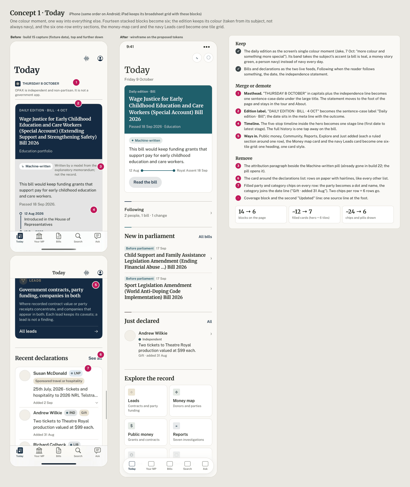
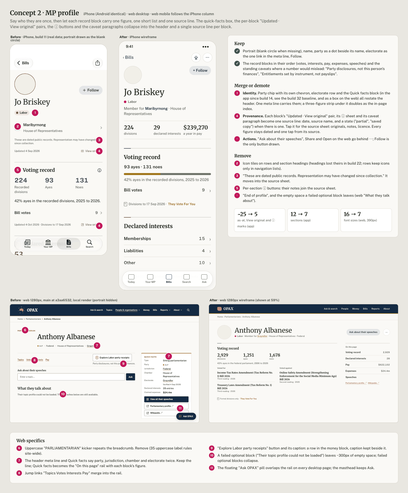
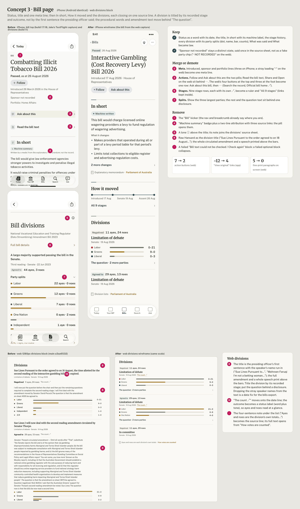
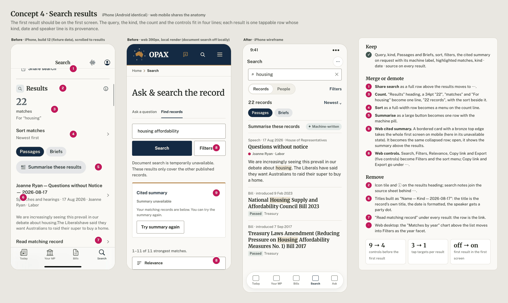
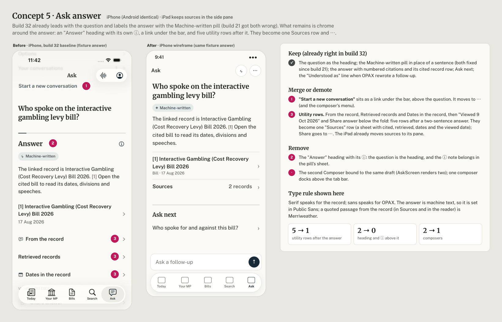
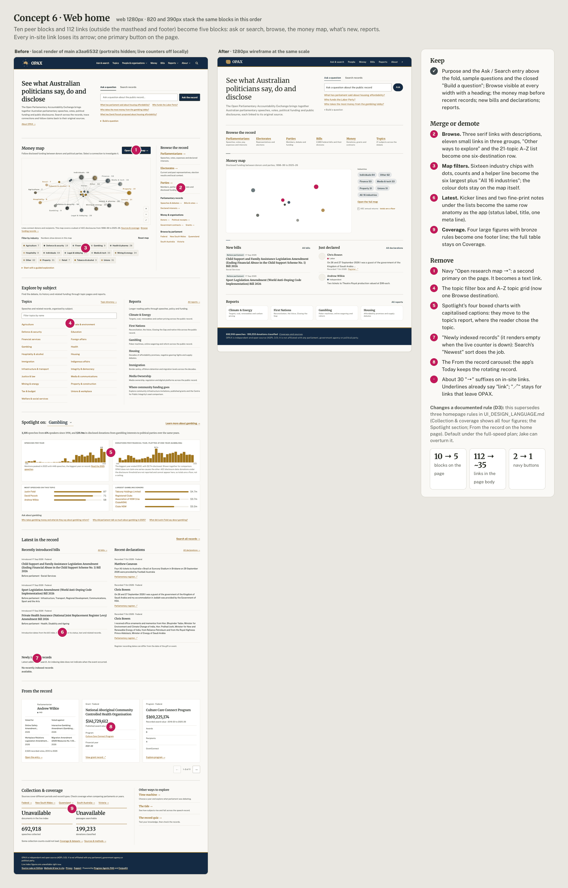

# OPAX design review, pass 1: audit, simplification and one design system

9 October 2026. Design lead's report for pass 1 of a multi-pass programme. This pass is analysis and specification only: no app or web code changed. Passes 2 to 5 implement, critique and refine it (section 7).

- **App:** `ios/app` at `b7e436b1` (TestFlight build 32), one React Native app for iPhone, iPad and Android.
- **Web:** `main` at `a3aa6532`, rendered locally with `wrangler dev` against the committed data.
- **Assets:** [`review-2026-10/`](review-2026-10/):
  - `web/`: fresh captures at 390 and 1280 px;
  - `app/`: the newest surviving device captures, with status bars painted out and MP portraits drawn as OPAX's blank circle (official portraits are CC BY-NC-ND);
  - `concepts/`: six before/after boards and their HTML sources;
  - [`design-tokens.json`](review-2026-10/design-tokens.json): the proposed single token source.

## Summary

The bones are good. The palette, the two typefaces and the hairline structure are shared and mostly well kept: the app's token layer is tidy (6 stray colours, 0 shadows, 89% of spacing on tokens). The busyness comes from five habits stacked on top of that foundation:

1. **Provenance repeated per block, in several forms at once.**
   - In the app, every block gets an as-at line, a "View original" link, an ⓘ button and often a caveat paragraph. That adds up to about 104 caption lines, 75 ⓘ buttons and 58 source links across 194 sections.
   - On the web, fine-print paragraphs follow every section: 210 text elements under 14 px on an MP profile.
2. **Too many species of small label.**
   - The app has 20 chip, pill or badge recipes in 4 shapes, including two different components both called `PartyChip`.
   - The web has 34 chip-like classes, 9 of them capsules the docs say not to use, and 35 uppercase "kicker" rules in 6 sizes.
   - The machine-written label is drawn 9 ways with 6 phrasings on the web and 5 ways in the app.
3. **Identity said two or three times.**
   - Kicker plus breadcrumb plus title: "PARLIAMENTARIAN" above "Home › Parliamentarians › …".
   - Header meta line plus a Quick facts box.
   - Nav title plus H1: the report title appears twice; Your MP stacks three titles.
4. **Too many visible actions.**
   - The web bill page draws seven buttons, four at the top and three at the foot.
   - At desktop widths a floating "Ask OPAX" pill sits over every page except the home page, including the Ask page itself.
   - App search results carry "Read matching record" under every row; Ask stacks four utility rows above the question.
5. **Two systems on the web.**
   - `style.css` is token-based.
   - Every feature module (home, community, money map, grants, ledger, time machine, quiz and the rest) ships its own dialect, which adds up to:
     - 115 distinct font sizes;
     - 130 colour literals;
     - 39 radii;
     - 45 shadows;
     - 569 `var(--token, #literal)` fallbacks, about 15 of which disagree with their token.

None of these needs new colour or new components. The fix is fewer, stricter ones, shared by both platforms.

### Top 10 simplifications, ranked

Ranked by how much visual weight each removes across how many screens, against effort.

| # | Simplification | Platforms | What it removes | Pass |
|---|---|---|---|---|
| 1 | **One source line per block.** "Updated 4 Oct 2026 · AEC annual returns", tappable, opens a source sheet with the originals, notes and licence. It replaces as-at lines, "View original", ⓘ, `Section info`, saved/partial notices and caveat paragraphs. Every figure stays dated and one tap from its source. | All | App: ~237 provenance marks down to one per block. Web: the fine-print paragraphs under each section (5 on a bill page, 4 on a profile). | 2 (component), 3–4 (screens) |
| 2 | **Five label kinds, sentence case:** StatusLabel, Tag, PartyLabel (dot + name, no fill), Choice/Filter chip, MachineLabel. | All | App: 20 recipes become 5. Web: 34 classes become 5. No more uppercase eyebrows (35 rules); the party chip fill in rows goes. | 2 |
| 3 | **Say identity once.** One title and one meta line; no kicker, Quick facts box or second title. | All | "PARLIAMENTARIAN / BILL / POLITICAL PARTY" kickers, web Quick facts on person and party pages, duplicate nav + H1 titles, Your MP's three titles. | 3 |
| 4 | **Front pages lose half their blocks.** Today goes from 14 blocks to 6: one colour moment (the edition, in its subject's accent) and one "Explore the record" tile grid. The web home goes from 10 blocks to 5. | iPhone, iPad, Android, web | On Today: five one-row sections, the Leads navy card, the money-map card and the coverage block. On the web home: Spotlight, From the record, Newly indexed records, the Topics A–Z list, the Collection & coverage figure grid and about 30 "→" arrows. | 3 |
| 5 | **One primary action per view; the rest under ⋯.** | All | Web: the floating Ask pill, and the bill page's seven buttons down to two. App: "Read matching record" per result, Share rows, Ask's utility rows above the question, the second Ask composer. | 2 (web pill), 3 |
| 6 | **One card, one level.** Radius 12, hairline, no shadow, never nested, never around a list, chart or In short. | All | App: five card radii and four card recipes. Web: 32 card-like classes, 40 bronze card edges and 45 shadows (down to one overlay shadow). | 2 |
| 7 | **Eleven type roles, six sizes, one meaning:** serif speaks for the record, sans speaks for OPAX. | All | App: 20 roles and 11 sizes. Web: 115 sizes, 33 line heights and 21 letter-spacings. | 2 |
| 8 | **Titles from fields, not raw text.** A division is titled by its recorded stage, with the question behind a disclosure; a search result uses its own title with the date formatted. | All | Division titles that start with the presiding officer's name and full sentence; amendments and whole speeches printed above the party bars; "Name — Kind — 2026-08-17" result titles. | 3 (+ bills export fix) |
| 9 | **One accent per view.** The accent belongs to the subject; accent marks appear only where sections differ by category (profiles, Today). | All | App: 111 accented sections become about 40, including About's 7 marks on prose and 15 inert accents that draw nothing. Web: adds accents only for subject figures, so the money map's 16 industry colours stay the only multi-colour element. | 2–4 |
| 10 | **Links say where they go once.** No "→" on in-site links; "↗" only for leaving OPAX, once per block; app chevrons only on rows that navigate. | Web, app | About 30 arrows on the web home; 9 "↗" on bill stages; duplicate "View original" pairs (two to one URL on the app party page). | 3 |

### Decisions for Jake

These change documented rules. Under Jake's "full speed" direction (9 Oct: no sign-off gate), passes 2 to 4 implement them as the defaults below. Jake can overturn any of them from the before/after shots at the end of a pass:

- **D1. Shape by role.** Things you press are pills on both platforms; things you read are 4-radius; things that hold content are 12-radius.
  - This keeps the app's build 12 capsule buttons.
  - On the web, it reverses the 19 Sep "4px buttons, no capsules" rule for buttons and choice chips only. Tags and status labels stay 4px.
  - Fallback if you prefer the broadsheet look: 4-radius everywhere, and the app reverts its capsules.
- **D2. Category accents on the web.** The web adopts the app's money, votes, interests and bills inks, but only for a section's accent mark and its display figure. Bronze stays the link and record colour.
- **D3. Home page composition.** This supersedes three 20 Sep rules in `UI_DESIGN_LANGUAGE.md`:
  - Collection & coverage becomes one footer line;
  - Spotlight moves to the reports;
  - From the record leaves the home page (Today keeps it).
- **D4. Today's independence line** moves from the top to the foot of Today. It stays in the tour and About.
- **D5. Division titles** use the recorded stage. Stripping the speaker-name prefix from division text is an export change in the bills pipeline.
- **D6. No uppercase labels anywhere.** "Daily edition · Bill", not "DAILY EDITION · BILL".

## 1. Method and limits

- **Web.**
  - Headless Chrome over CDP against a local `wrangler dev`, at 390, 820 and 1280 px, with reduced motion on.
  - Analytics, opax.com.au and every generation, voice, community and OG route were blocked.
  - Each page also got a DOM census: font sizes, text colours, elements under 14 px, rules, chip-like and boxed elements, links, buttons and folds (appendix A).
  - The local Worker has no ARAG or D1 credentials, so four surfaces rendered their degraded states:
    - document search, so search shows catalog results only and a "Summary unavailable" card;
    - the division document page, which rendered "resource fetch failed (400)";
    - community, which rendered "Failed to fetch";
    - the person page's topics.
  - Those error states are themselves findings (section 4); the healthy versions are gaps (section 3).
- **App.** No simulator or emulator ran tonight: the Mac's shared device slot is promised to another program until tomorrow. Sources:
  - captures that survive in lane worktrees and local scratch folders;
  - Jake's TestFlight screenshots;
  - a code census of `mobile/src` by an audit agent (counts exact for literals, estimated for render sites, about 25 citations spot-checked).
  - Lane worktrees from build 17 on were deleted after merge with their captures, so the newest full iPhone set is builds 11 to 16. Each capture below names its build; later builds changed several screens (noted per screen).
- **Data in mockups.** Wireframes reuse text from the captures: public parliamentary records, or fixture text where the capture was a fixture run. Nothing was invented about a real person.
- **Scale.** Effort and device-time estimates assume the current lane tooling (Opus workers, `e2e.sh`, `review-pages.yaml`) and the one-device-block-a-day rule for the shared Mac.

## 2. Design principles

Seven rules that make the simplification decisions repeatable. When a screen breaks one, the rule wins unless a non-negotiable needs the exception.

1. **One accent per view.** Paper, ink, navy and bronze are the constant. A view may add the accent of its subject (money green, votes indigo, interests plum, bills teal), and only in three places: the section mark, the block's one display figure, an icon tile. Party colour is a dot beside a party name, never a fill, a series or a mood.
2. **One level of container.** Sections are separated by a rule, not a box. A card (radius 12, hairline, no shadow) is for a unit you can pick up: an edition, a lead, a report, a Today tile. Cards never nest and never wrap a list, a chart or a summary.
3. **Say it once.** A screen has one title, one meta line under it and no kicker. A section title never repeats the screen title or its own first row. A label never repeats its control ("Chamber" above "All chambers").
4. **Provenance behind one affordance.** Each block ends in one source line: date, source name, and a state when there is one. Tapping it opens the originals, the notes and the licence. The only caveat drawn inline is one short line where a number would otherwise mislead ("Party disclosures, not this person's finances").
5. **One primary action per view.** It is navy. Up to two other drawn actions per block are secondary pills; everything else lives under ⋯ (or the share sheet). Navigation is a row or a link, not a button.
6. **Five kinds of small label, all sentence case:**
   - Status: a word with a tone;
   - Tag: a topic, in bronze;
   - Party: a dot beside the party name;
   - Chip: you choose it or remove it;
   - Machine: the machine-written pill.

   Nothing else gets a pill, and nothing is uppercase or letter-spaced.
7. **Serif speaks for the record; sans speaks for OPAX.** Merriweather is for titles, headings, the words of the record and display figures. Public Sans is for interface, OPAX's own sentences and machine-written text. Six sizes cover everything: 34, 22, 18, 17 (16 on the web), 15, 13.

Two state rules apply everywhere:

- **Failed blocks.** A failed optional block collapses rather than leaving a hole or an error box.
- **Error copy.** Error text is a plain sentence with a retry, never a raw message ("resource fetch failed (400)", "Failed to fetch").

## 3. Screen inventory

`bN` = the TestFlight build whose code the capture shows. "Fixture" = simulator run against pinned fixture data. The full inventory, with source paths and private-data checks, came from the inventory pass. Committed copies are in `review-2026-10/app/` and `web/`.

| Screen | iPhone (standard) | iPhone AX5 | iPad | Android | Web desktop / mobile |
|---|---|---|---|---|---|
| Welcome tour | b11 (store shot) | b11 | **gap** (b31 redesign lost) | **gap** | n/a |
| Today / Home | b15 fixture (top, declarations); predates b17 Public money, b23 Explore, b25 Community | b12 (declarations only) | b27 Today grid, sidebar (675×900) | play-prep (~b17) | Home 390 / 820 / 1280 (tonight) |
| Your MP | b11 real | b12 | **gap** | play-prep | n/a |
| MP profile | b11 real; Jake b20 header crop | b14 | b28 directory split; Jake b29 | parity (~b17) | 390 / 1280 (tonight) |
| Party | b14 fixture | **gap** | b28 directory (not copied) | bringup | 390 / 1280 |
| Electorate | b11 real (predates b19 date picker) | **gap** | b28 (not copied) | bringup | 390 / 1280 |
| Bills list | b12 fixture (predates b19 filters) | b12 | b27 split | **gap** | 390 / 1280 |
| Bill | Jake b17/18 top; b11 divisions | **gap** | b27 split; Jake b29 sponsor crop | play-prep | 390 / 1280 |
| Division | b12 fixture | **gap** | **gap** | bringup (bill divisions) | error state only locally; Jake's 9 Oct markdown bug shot |
| Search | b12 idle + Passages; b32 AX5 idle | b32 | b28 split | bringup idle | 390 / 1280 (catalog results only) |
| Record reader | b14 fixture | **gap** | **gap** | parity (not copied) | **gap** (needs ARAG) |
| Ask | b16 idle, stages, answer (pre-b22 composer); Jake b21, b22 | b16 | b28 + Jake b29 sources pane | play-prep idle | Ask idle 390 / 1280 |
| Talk | b11 | b12 | **gap** | n/a (voice off on Android) | n/a |
| Money map / public money | b12 map; public money **gap** | **gap** | **gap** | bringup | Money 390 / 1280 |
| Reports / report | b15 fixture | b15 | **gap** | parity (not copied) | 390 / 1280 |
| Leads | b12 fixture | **gap** | **gap** | **gap** | **gap** (`/discover`) |
| Declarations | b12 fixture | b12 | **gap** | **gap** | home rows only; `/declared` **gap** |
| Follows | b14 fixture | **gap** | **gap** | **gap** | n/a |
| Account / About / Sources | b15 account; Sources only b9 AX5 sheet | b9 | **gap** | bringup (not copied) | About 390 / 1280 |
| Explore | **gap** | **gap** | **gap** | play-prep hub | **gap** |
| Community | **gap** | **gap** | **gap** | play-prep (web hand-off) | error state only locally |
| Directories | b30 (414×900) | b30 (414×900) | b28 | **gap** | directory pages not captured |

**Committed copies** (best current capture per screen; status bars painted out, portraits blank):

- `app/`:
  - `iphone-today-top-b15.png`, `iphone-today-declarations-b15.png`;
  - `iphone-your-mp-b11.png`;
  - `iphone-person-b11.png`, `iphone-person-interests-b11.png`;
  - `iphone-party-b14.png`, `iphone-electorate-b11.png`;
  - `iphone-bill-top-b17.png`, `iphone-bill-divisions-b11.png`;
  - `iphone-search-results-b12.png`, `iphone-ask-answer-b21.png`;
  - `iphone-leads-b12.png`, `iphone-report-b15.png`;
  - `ipad-today-b27.png`, `android-today.png`.
- `web/` (first screen at 1280 px unless named):
  - `home`, `person`, `party`, `bill`, `bills`, `search-passages`, `ask-idle`, `electorate`, `money`, `reports`, `report`, `about`;
  - two error states: `division`, `community`;
  - at 390 px: `home`, `person`, `party`, `bill`, `search-passages`, `ask-idle`, `electorate`;
  - full-page strips: `home`, `person`, `party`, `bill`;
  - the bill's divisions block.

Gaps are filled in tomorrow's device block (section 8). Web gaps that need ARAG or D1 (document search with Passages and Briefs, the record reader, a division page, `/discover`, `/declared`, community) need either a dev ARAG token on `wrangler dev` or Jake's OK for read-only GETs of the public pages on opax.com.au.

## 4. "Too busy" audit, per screen

App counts are estimates from the code census of build 32 code. Web counts are tonight's DOM census at 390 and 1280 px (appendix A). Each screen lists **Keep** (it carries meaning), **Merge or demote**, and **Remove**. Non-negotiables hold throughout:

- every figure dated and sourced, one tap away;
- machine text labelled;
- "Example" labels in the tour;
- party colour never alone;
- AX5 word-safe text and 44 pt targets.

### Front pages

**Today (iPhone, Android; iPad broadsheet).** 14 blocks in order: masthead, edition, Following, Public money, Community, Reports, Explore, Spotlight, From the record, Coverage, Recently introduced bills, Money map card, Leads card, Recent declarations. Other counts:

- about 12 filled cards, including the edition's nested figure tiles and chips;
- 22 to 28 chip sites (each declaration row carries a filled party chip and a filled category chip);
- 5 accent keys, and two navy blocks on one screen (edition and Leads);
- a parallel colour system (`today/tint.ts`: `accentOf`, `washOf`, a second `Accent` type) and 29 static palette reads that skip Increase Contrast.

- **Keep:**
  - the edition as the single colour moment, in its subject's accent rather than always navy (Jake, 7 Oct: "more colour and something more special");
  - Following when the reader follows something;
  - the two live feeds (bills, declarations), the date, the independence statement.
- **Merge or demote:**
  - Public money, Community, Reports, Explore, Just added (each a ruled section around one row), the money-map card and the Leads card become one six-tile "Explore the record" grid;
  - the five-stop timeline in the hero becomes one stage line;
  - the independence line moves to the foot (D4);
  - category goes into the date line ("Gift · added 31 Aug");
  - iPad keeps its broadsheet: hero beside a rail holding Following and the tile grid.
- **Remove:**
  - the uppercase date and edition labels;
  - the card around the declarations list;
  - filled chips in rows;
  - the Coverage block (it moves to About);
  - the second "Updated" caption style (`UpdatedCaption`, 13 pt, beside `AsAtLine`, 12 pt);
  - `today/tint.ts` (accents and party washes come from tokens).
- See [concept 1](review-2026-10/concepts/01-today.png).

**Web home.** 10 blocks. At 1280 px: 14 font sizes, 99 rules, 112 links, 208 text elements under 14 px, 2 navy buttons, about 30 "→" suffixes. At 390 px the page is 10,018 px tall.

- **Keep:**
  - purpose and Ask/Search above the fold;
  - sample questions, with "Build a question" closed;
  - Browse visible at every width;
  - the money map before recent records;
  - new bills and declarations, reports.
- **Merge or demote:**
  - the Browse rail (3 + 11 links), "Other ways to explore" and the 21-topic grid become one six-destination row;
  - 16 industry chips become the 6 largest plus "All 16 industries";
  - Collection & coverage becomes one footer line (D3).
- **Remove:**
  - the navy "Open research map" (a second primary);
  - Spotlight's four boxed charts with uppercase captions (they move to the topic's report);
  - "Newly indexed records" (empty whenever the live counter is down);
  - From the record (Today keeps it);
  - in-site arrows.
- See [concept 6](review-2026-10/concepts/06-web-home.png).

### People and places

**MP profile (app Person; web `/subject/person`).** App counts:

- 12 sections, about 18 disclosures;
- about 9 as-at lines, up to 7 "View original" and 4 to 5 ⓘ;
- "Quick facts" restates the hero;
- "End of profile".

Web counts:

- 16 font sizes at 390;
- 204 to 210 elements under 14 px, 15 folds;
- a Quick facts box repeating the header;
- jump links, an "Explore Labor party receipts" button with caption, and an "Ask about their speeches" field;
- a failed topics block leaving about 300 px of blank space;
- the floating Ask pill over the rail.

- **Keep:**
  - portrait (blank circle when missing), name, party dot and name, electorate link, Follow;
  - the record blocks in their order;
  - standing caveats where a number would mislead ("Party disclosures, not this person's finances"; "entitlements set by instrument, not payslips").
- **Merge or demote:**
  - header, Quick facts and jump links become one meta line plus a three-figure strip (app), or an "On this page" rail with each block's figure (web);
  - per-block "Updated · View original" plus ⓘ plus caveat becomes one source line;
  - "Some rows in this export could not be read." (twice) becomes the "partial" state on the source line;
  - "Ask about their speeches" goes behind ⋯ (app), or becomes one secondary pill (web).
- **Remove:**
  - the uppercase "PARLIAMENTARIAN" kicker;
  - icon tiles on rows;
  - per-section ⓘ;
  - the visible "End of profile" text. Keep its testID as a hidden view: `review-pages.yaml` scrolls until it appears.
- See [concept 2](review-2026-10/concepts/02-mp-profile.png).

**Your MP (app).**

- Counts: 8 to 9 sections over 6 accent keys; 7 to 8 as-at lines each paired with a "View original" (6); 3 ⓘ; three stacked titles (large title "Your MP", kicker "Your electorate", H1 seat).
- **Keep:** the seat, your member, your senators, recent votes, the seat's money.
- **Merge or demote:**
  - the large title stays and the seat becomes the H1;
  - the "Your electorate" kicker goes;
  - one source line per block;
  - "Voted for / Voted against" become StatusLabels in the done and ended tones.
- **Remove:**
  - the "Electorate record" row's icon tile;
  - the paired as-at and "View original" lines (5 of 6).

**Party (app; web `/subject/party`).**

App counts:

- a party-wash hero card with a Follow capsule inside it (nested);
- 9 sections, 15 to 17 disclosures (10 per-year), 8 ⓘ;
- 8 as-at lines, two of them back to back;
- two "View original" links to the same register URL;
- "End of party page".

Web counts:

- 17 text colours, 359 elements under 14 px at 1280, 15 font sizes;
- a 3D map embed with popup at the top;
- Quick facts with four buttons;
- "Where it came from" and "Largest creditors" boxed inside sections;
- 27 rows of three-part receipt bars, each with "% not itemised".

- **Keep:**
  - received total and rank, where it came from, receipts by year, debts, members, divisions;
  - the "floor, not a ceiling" caveat (one line).
- **Merge or demote:**
  - Quick facts becomes a header figure strip;
  - four rail buttons become one secondary pill ("Explain where the money comes from", with its machine label) plus ⋯;
  - the map embed moves below the figures, as a link card on phones;
  - the receipts table shows the latest 10 years with the rest behind "All 27 years".
- **Remove:**
  - the boxes around lists inside sections;
  - the Follow capsule inside the hero card (it moves to the header row);
  - the duplicate "View original";
  - uppercase "POLITICAL PARTY / ACTIVE 1998–2025".

**Electorate (app; web `/subject/electorate`).**

App counts:

- a 250 pt sunken map frame (radius 14) with a two-line caption, an ⓘ and a "Source geometry" link;
- "Representation is shown only as recorded in the dated release" three times;
- 5 ⓘ, "End of electorate record".

Web counts:

- uppercase "ELECTORATE · FEDERAL" kicker;
- a date picker plus "View" button placed above the history it filters;
- two caption lines under the outline;
- 77 rules, 15 font sizes, 181 small-text elements;
- 12 census figures in display serif.

- **Keep:** current representation with its verified-as-at date, the election timeline, history, census context, the outline.
- **Merge or demote:**
  - "View representation on a date" moves into Representation history as an "On a date" control;
  - the outline captions join the source line;
  - census figures become a compact key-value grid in metadata size (one display figure at most: population).
- **Remove:** the repeated release caveat (keep one, in the source sheet); the kicker; "End of electorate record".

### Bills and divisions

**Bills list.** This is the web's cleanest list and the model for others: 7 font sizes, one row anatomy. The app adds a status pill plus "as at 28 Sep 2026" on every row and an ⓘ beside the count.

- **Keep:** status, title, chamber, introduced date, portfolio; filters.
- **Merge or demote:** "as at" appears once, in the list's source line, not per row; web party abbreviations ("● LIB") become dot plus name in sentence case.
- **Remove:** the ⓘ beside the count (its note joins the source sheet).

**Bill (app; web `/bill/<key>`).**

App counts:

- 6 sections;
- about 12 identical "View original" links;
- a status-label recipe copied three times (`BillStatus`, `VoteSide`, `outcomeLabel`);
- a machine summary pill plus a two-line attribution;
- "Ask about this" and "Read the bill text" as sunken rows.

Web counts:

- uppercase "BILL" kicker;
- "Sponsor not recorded · NOT RECORDED" (a fake party chip) and a meta line starting with "·";
- 4 action buttons at the top and 3 at the foot;
- an In short card with a bronze left bar, fill, uppercase badge and three-link attribution;
- 9 stage rows, each with "↗";
- 5 fine-print paragraphs;
- division titles taken from raw Hansard, with amendments and whole speeches printed above the bars.

- **Keep:** status word with date, title, In short with its machine label, stage history, every division with party splits, What was said, What became law; "Sponsor not recorded" as a distinct state, said once.
- **Merge or demote:**
  - meta lines become one;
  - actions become Follow and Ask about this (app), or one secondary pill plus ⋯ (web);
  - stages become a ruler plus "All 9 stages";
  - splits show the three largest parties, with the rest and the question behind one disclosure.
- **Remove:**
  - the kicker, the uppercase badge and the attribution paragraph;
  - the In short card chrome;
  - raw Hansard division titles (D5);
  - the failed "Bill text could not be checked / Check again" block (it collapses);
  - the foot action row.
- See [concept 3](review-2026-10/concepts/03-bill.png).

**Division (app focused divisions and division history; web `/doc/division-…`).** App: the focused view's header is a lone ⓘ with the H1 below it, then a "Full bill details" link. Web: tonight's local render showed "Document unavailable / resource fetch failed (400)", and Jake's 9 Oct capture showed raw `###` and `>` markdown (since fixed).

- **Keep:** outcome, counts, date, chamber, party splits, member lists, the count's original.
- **Merge or demote:** titled by stage, as on the bill; the bill appears as a link row under the title.
- **Remove:** the lone ⓘ; raw error strings (use the error state's sentence).

### Research

**Search (app; web `/ask?view=search`).**

App: about 9 controls before the first result:

- Share search row;
- Results heading with icon tile and ⓘ;
- a 34 pt "22";
- "matches", "For housing";
- Sort row, Passages/Briefs;
- a large "Summarise these results" button;
- then each result carries "Read matching record";
- Briefs mark machine text as plain fine text, not the pill.

Web:

- a cited-summary card with a bronze top edge that fills the mobile fold;
- five controls (Search, Filters, Relevance, Copy link, Export);
- a "Matches by year" chart above the list;
- result meta "Bill · Bill register".

- **Keep:** query, kind, Passages/Briefs, sort, filters, summary on request with the machine label, kind · date · source per result, highlighted matches.
- **Merge or demote:**
  - the count, sort and share collapse into one line;
  - Summarise becomes a row with the machine pill;
  - the web summary card becomes the same collapsed row;
  - Copy link and Export go to ⋯;
  - "Matches by year" becomes the year facet inside Filters.
- **Remove:** "Read matching record"; the icon tile and ⓘ on the heading; built titles like "Name — Kind — ISO date".
- See [concept 4](review-2026-10/concepts/04-search.png).

**Record reader (app `doc/<slug>`; web `/doc/<slug>`).**

- App counts: "Speech" kicker; a speaker row with an icon tile; "Updated 4 Feb 2026"; "View original"; Cite and Copy link (built twice, in `DocumentReader.tsx` and `RecordActions.tsx`); an "Ask about this" row; In brief with an ⓘ plus "Machine summary · not part of the record".
- **Keep:** the record text in Merriweather, the speaker as a PersonRow, date and chamber, the original, Cite.
- **Merge or demote:**
  - Cite, Copy link and Share go to one ⋯;
  - In brief keeps only the pill;
  - "View original" becomes the source line.
- **Remove:** the kicker; the duplicate action implementation. Web reader not captured (gap).

**Ask (app; web `/ask`).**

App answer counts:

- Retrieved records, Dates in the record, "Viewed 8 Oct 2026" and Share answer above the question;
- the question shown twice when rewritten;
- an "Answer" heading with icon tile and ⓘ;
- the machine sentence, with no pill;
- two Composers bound to one draft.

Web idle counts:

- the full sentence builder open by default, plus a free-text form: two submit buttons ("Ask this", "Ask the record") and Options;
- a "Try a question" label (the homepage rule removed that label);
- four boxed sample buttons;
- the floating Ask pill on the Ask page itself.

- **Keep:** question, answer, citations, machine label, sources, people named, follow-ups, Understood-as (one line, only when rewritten).
- **Merge or demote:**
  - utility rows come after the answer, as one Sources row plus ⋯;
  - the web builder is closed by default, as on the home page;
  - samples become plain links.
- **Remove:** the Answer heading; the second composer; the "Try a question" label; the floating pill.
- See [concept 5](review-2026-10/concepts/05-ask.png).

**Talk (app).** Already light, and Jake's direction ("minimal, animated") is met.

- **Keep:** the orb, captions, three call controls.
- **Merge or demote:** none.
- **Remove:**
  - `CallControls`' own hex colours (pressed red `#86191F` becomes `dangerPressed`; `VoiceOrb`'s rgba re-spellings become tokens);
  - the opacity-based pressed state in `Consent.tsx`;
  - the raw 13/16 count badge font.

### Money and leads

**Money map (app; web `/money`).** Both are tools; keep their density, trim the chrome.

App counts:

- a nav title "Money map" over "Political donations & public money map";
- "413 nodes · 1,159 recorded flows · 1998 to 2027";
- list mode has about 400 rows, each with "View original" and the fine line "Public-money record".

Web counts:

- four toolbar controls, two text links and a "Map key" button;
- a Sources fold;
- the floating pill over the zoom controls;
- the industry palette defined in five places (app.js, ledger.js, home.html, graph/palette.ts, the app port).

- **Keep:** the scene, years, industries, list mode, node pages.
- **Merge or demote:**
  - the subtitle and stats become one meta line;
  - the per-row source moves to the node page.
- **Remove:** the repeated per-row "View original" and caption; the duplicated palettes (one `chart.industry` token set).

**Public money hub (app).** 4 sections holding 8 rows whose `accent="money"` draws nothing, and a "Programs & places" section whose only row is "Programs & places".

- **Merge or demote:** one heading, one list.
- **Remove:** the inert accents and the self-titled section.

**Leads (app; web `/discover` not captured).** Counts:

- 10 bordered cards a page (radius 14), each about 20 text nodes;
- methodology always unfolded (about 37 fine lines);
- 11 as-at lines.

- **Keep:** a lead as a card (it is a unit), its figure, the "a lead is not a finding" framing, its evidence.
- **Merge or demote:**
  - each card shows its title, one figure, one sentence and "Evidence (n)";
  - methodology goes to the source sheet;
  - as-at appears once at the top.
- **Remove:** the per-card caveat repeats; the "See the comparison" row per card (the card opens it).

**Declarations feed (app; web `/declared` not captured).** Counts:

- 2 chips per row × 300 rows;
- "Chamber" above "All chambers" and "Jurisdiction" above "All jurisdictions" (the latter has one real value);
- a `numberOfLines` clamp the README forbids.

- **Merge or demote:**
  - filters go into a Filters sheet with one summary line ("All chambers · Federal");
  - rows use Today's anatomy (portrait, name, party label, text, "Gift · added 31 Aug");
  - the clamp becomes a Disclosure.
- **Remove:** the labels over their own chips; the per-row category chip.

### Reports and Explore

**Reports index.**

- App: a "Reports" section under a "Reports" nav title, and "Updated …" in each of 7 rows.
- Web: clean cards with icons.
- **Merge or demote:** one "Updated" line for the set.
- **Remove:** the self-titled section.

**Report page (app; web `/reports/<slug>`).**

App counts:

- 13 sections;
- the title twice (nav plus H1);
- `MachineWritten` × 10;
- about 78 "Citation N" capsules;
- 8 "Share this section" buttons.

Web counts:

- 41,105 px tall at 390;
- capsule topic chips with counts;
- superscript citation runs ("1 2 3 4 5 6").

- **Keep:** essays, sections, citations, the Now / Over time / Money views.
- **Merge or demote:**
  - one machine label at the top ("Sections are machine-written from the record");
  - citations become superscript numerals that open the source sheet;
  - section share goes to ⋯;
  - the three views become a sticky segmented control.
- **Remove:** the duplicate title; per-section pills; capsule topic chips (they become Tags).

**Explore (app hub and tools; web modules).**

- The hub is light (6 rows). The tools are games and keep their own layouts, but their chrome adopts the shared buttons: Matrix draws about 85 to 105 small default buttons.
- The web modules carry the heaviest dialects (timemachine 127 and grants 124 token fallbacks; quiz fallbacks that disagree with the tokens). Pass 4 moves their CSS to tokens without fallbacks.

### Account, about and the rest

**Account sheet, About, Sources and licences (app).**

- Account: an "About OPAX" section whose first row is "About OPAX".
- About: 7 accent marks on a prose screen.
- Sources: about 30 disclosures, which is right for the one licences screen.
- **Remove:**
  - the self-titled sections;
  - About's accent marks;
  - "End of sources and licences" (keep it as a hidden testID).

**Web About.** 15,199 px at 390 in one column of prose. Keep the prose; add an "On this page" index at regular width; 78 rules at 1280 become section rules only.

**Community (app; web `/community`).**

App counts:

- home has 4 sections, 2 of them rule-only around a single control;
- 6 of 7 "Your community" rows lead to the sign-in wall when signed out;
- the search box uses raw font values.

Web counts:

- its own navy header with a "Community" wordmark;
- "Opax" spelling;
- a raw "Failed to fetch" banner above "We could not load the account service".

- **Merge or demote:**
  - signed out shows one sign-in prompt instead of six walls;
  - the web uses the OPAX masthead with a Community sub-navigation.
- **Remove:** the raw error banner; "Opax" (use "OPAX", per `IOS-UX.md` §6).

**Follows (app).** 36 pt icon badges per follow, plus a quiet "Unfollow" per row.

- **Merge or demote:** Unfollow moves to a swipe action and the context menu.
- **Keep:** the change dot.

**Welcome tour.**

- **Keep:** "Example" labels (non-negotiable), one idea per page, Skip.
- Check the b31 iPad redesign and the b32 "Back unseen on page 1" fix tomorrow (no surviving capture).

### iPad and Android notes

- **iPad.** Today's broadsheet stacks the busiest version of Today:
  - navy edition, navy Leads card, green Money map card, a Following card and a Public money row;
  - bill cards with a navy top rule.

  Apply the Today concept with a rail. Elsewhere:
  - `SplitEmpty` and `EmptyState` become one component with a size;
  - split rows keep `SelectedMark`.
- **Android.**
  - Same screens and the same simplifications.
  - It has no Increase Contrast, because the palette falls back to plain hex; pass 4 checks the Android "high contrast text" setting against the HC roles.
  - 48 dp targets are already in tokens.
  - Community and Talk are web hand-offs or unavailable, so their screens stay minimal.

### Web chrome

- **Keep:** masthead, breadcrumbs (they replace kickers), footer.
- **Remove:**
  - the floating "Ask OPAX" pill on desktop pages (the masthead keeps Ask; below 801px the header already has the chat icon);
  - "corpus loading…" in the footer when the counter fails (hide the line).

## 5. One design system

### 5.1 Token diff

| Area | Web today | App today | Canonical ([design-tokens.json](review-2026-10/design-tokens.json)) |
|---|---|---|---|
| **Core colour** | 29 `:root` properties. 130 colour literals elsewhere: money-map warm greys, 19 cool blue-greys with no token, navy at 9 alphas, bronze at 8. 4 undefined tokens in use (`--accent`, `--paper-warm`, `--error-ink`, `--mm-award-colour`). | 28 roles; same core hex values as the web; 9 Increase Contrast overrides; 67 static `light.*` reads in features that skip IC. | 30 roles in 7 groups (surface, text, brand, line, feedback, accent, status), same hex values. Renamed: `line` → `dividerSubtle`, `lineStrong` → `line.control`. New: `dangerPressed` and the four status tones. |
| **Category accents** | None (bronze only) | money, votes, interests, bills inks and washes; `people` = `places` | Four accents plus people (navy) and leads (bronze); `places` removed; usage limited to mark, figure and tile |
| **Party** | 8 dot tokens; the money-map exporter draws a second palette (Labor `#D93025`, Nationals `#1B5E20`, …); fallback greys | 8 dots plus 8 washes (12%); Today derives its own 14% washes | 8 dot + wash pairs, one set; the exporter adopts them; washes only on a party's own header |
| **Chart** | `--chart-mark` = bronze; industry palette copied 5 times | money-map port of the same palette | `chart.mark`, `chart.baseline`, `chart.contrast`, `chart.industry.*` |
| **Type** | 3 heading tokens (15 uses); `home.css` has its own 32/26/18 px scale; 115 distinct sizes; 33 line heights; 21 letter-spacings; 35 uppercase rules | 20 roles, 11 sizes, Dynamic Type ramps to AX5 | 11 roles, 6 sizes (34, 22, 18, 17 / web 16, 15, 13) plus the fluid web title and its iPad step; sentence case; tabular figures |
| **Spacing** | `--space-1..7` = 4, 6.4, 10.4, 16, 25.6, 41.6, 67.2 px; 14% of lengths use them (2,808 raw lengths, 137 values) | `spacing` (4, 6, 8, 16, 26, 32, 52) and `rhythm` (4, 8, 12, 16, 24, 36, 20); 89% tokenised | One rhythm: line 4, tight 8, row 10, heading 12, block 16, group 24, section 36 (56 at regular width), screen 20 (32 regular; web clamp) |
| **Radii** | 39 values; docs say 4 px; 9 capsule classes | 1 token (4) but 8 values drawn; capsules on every button and chip | sm 4 (read), md 12 (hold), pill 999 (press), 50% (portraits and dots) (D1) |
| **Borders** | 6 widths, 57 colour strings; 40 bronze 2–3 px edges | hairline 1; focus 2; widths 1.5 and 3 in places | hairline 1, focus 2, accent mark 28 × 2, masthead 3 (the only 3 px rule) |
| **Elevation** | 45 shadows in 5 tints | none | none, plus one `overlay` shadow for floating surfaces |
| **Motion** | 30 durations, 12 easings, 43 keyframes (1 unused), 3 spinners; reduced motion handled per file | ad hoc per component; reduced motion centralised in hooks | quick 120 ms, standard 200 ms, gentle 400 ms, ambient 16 s; one curve; reduced = instant |
| **Targets** | 44 px on touch, compact 40 | 44 pt iOS / 48 dp Android | `size.target` 44 (48 Android); controls 44/48/56; three icon sizes (16/20/28; the app draws 11) |

**Pipeline (pass 2).**

- Move the JSON to `docs/design/design-tokens.json`.
- `scripts/build_tokens.mjs` writes:
  - `portal/public/tokens.css`: `:root` custom properties, plus the old names as aliases for one release;
  - `mobile/src/design/tokens.generated.ts`, which `palette.ts` and `tokens.ts` re-export.
- Tests:
  - the app's `contrast.test.ts` reads the generated pairs;
  - a web test fails on any new hex literal outside `tokens.css` and the vendored map CSS;
  - CI checks the generated files are fresh.

### 5.2 Component spec

One table for both platforms. "Web" names the CSS hook; "App" names the `src/design` export.

| Component | Anatomy | Sizes | States | Use when | Don't use when |
|---|---|---|---|---|---|
| **Button** (web `.ui-button`, app `Button`) | Pill; label in `control`; optional leading icon. Variants: primary (navy), secondary (navy wash, no outline), quiet (text), danger | 44 / 48 / 56 min height; grows with text; full width and leading-aligned at AX sizes | rest, pressed (role swap), disabled, busy (keeps width and label for VoiceOver), on (toggle: Follow) | One primary per view; up to two secondary per block | Navigating to a page (use a row or link); more than two drawn actions in a block; any bronze or gold fill |
| **IconButton** | 44 circle; 20 pt symbol; required label | 44; large 56 (Talk) | rest, pressed, disabled | ⋯, share, voice, close | Anything with a word that fits |
| **Segmented control** | Pill track (sunken) with a pill thumb (raised) | 48 outer; stacks at AX | selected, pressed | 2–3 views of the same content (3D / List, Records / People, Now / Over time / Money) | 4 or more options, long names, filtering (use chips) |
| **Choice chip** | Pill, 36 drawn / 44 target; navy wash or navy when selected | one size | selected, pressed, disabled | Picking among peers in a filter row or sheet | Removing an applied filter (FilterChip); navigation |
| **Filter chip** | Pill, "Key **Value** ✕"; the whole chip removes | 40 drawn / 44 target | rest, pressed | An applied filter above results | Anything that isn't removable |
| **Tag** | radius 4, bronze wash, bronze-ink label; link or plain | 28 drawn / 44 target when linked | rest, pressed | A topic | A control; a status; a count badge |
| **StatusLabel** | radius 4, tone wash + ink, `label` role; always a word | one size | done, active, ended, draft | Bill stage, division outcome, vote side | As a button; more than one per row |
| **PartyLabel** | 10 pt dot + party name, `label` role, ink-soft | one size; full name on profiles, short name only in dense tables (full name spoken) | none | Wherever a person or party appears | Colour without the name; a filled pill in rows |
| **MachineLabel** | Pill, bills wash, ✦ + "Machine-written"; opens the attribution sheet | 26 drawn / 44 target | rest, pressed | Once at the top of each machine-written block (In short, brief, answer, report sections) | As a sentence, a badge plus paragraph, or per paragraph |
| **SourceLine + SourceSheet** | Doc glyph, date, source name in bronze ink, optional state ("partial", "saved copy", "offline"); the sheet lists originals (View original), as-at and coverage, notes and caveats, licence | 32 drawn / 44 target; full width at AX | rest, pressed, state | Once at the foot of every block that shows figures or records | Alongside a separate as-at line, ⓘ or "View original" in the same block |
| **Section** | Top rule (divider); optional 2 pt accent mark; heading plus one trailing link; content; SourceLine | section gap 36 / 56 | none | Every block of a screen | Inside a card; with a title equal to the screen's or its first row's; with an icon tile or ⓘ |
| **PageHeader** | Optional portrait (72, blank circle); title; one meta line; up to two pills and ⋯ | title 34 (iPad 42; web fluid) | loading (title-sized bar) | Every detail screen | With a kicker, a second title or a facts box |
| **Rows** | LinkRow (title, detail, value, chevron or ↗); PersonRow (portrait 44, name, PartyLabel, place · date); RecordRow (kind · date, title, snippet); BillRow (StatusLabel + date, title, portfolio); KeyValueList; Disclosure | min 44; content rows 10 from each hairline | pressed, selected (iPad), disabled | Lists of anything | Icon tiles outside navigation lists; per-row buttons beside the row's own link |
| **Card** | radius 12, raised, 1 px subtle line, no shadow | padding 14–18 | pressed (when the whole card is a link) | An edition, a lead, a report, a Today tile, an iPad grid cell | Nested; around a list, chart, In short or section; for a boundary |
| **Figure** | `display` number (may take the accent), `metadata` label, optional `fine` period | up to 3 in a strip | none | The one number a block is about | Counts that aren't the subject ("22 matches") |
| **States** | Loading (layout-stable bars; the wombat only for long web waits); Empty (glyph + one sentence; a size for iPad panes); Error (one plain sentence + Try again); SavedCopy (a SourceLine state where possible) | fits its block | none | Any async block | Raw error text; failed optional blocks (they collapse) |
| **Composer** | radius 12, raised, send circle (navy) | grows to 40% of the window | empty, typing, busy | Ask and follow-ups, one per screen | Search (use the field) |

### 5.3 Deprecated variants to remove

The full map is in `design-tokens.json` under `$deprecated`. Headlines:

- **Web:**
  - `.kicker` and 34 other uppercase label rules;
  - the 9 capsule chip classes (`.chip`, `.topic-chip`, `.doc-brief-tag`, `.tie-tag`, `.report-chip`, `.nr-source`, `.tvn-chip`, `.explain-step`, `.gr-count`);
  - 30 bespoke button classes, plus the bronze topic-ask buttons (`style.css:2964-2981`) that break the "no bronze button" rule;
  - 8 `*-fineprint` module copies and the 90 note/meta/caption classes (they become `fine` via the SourceLine);
  - 2–3 px bronze card edges (`.infobox`, `.search-answer`, `.doc-brief`, `.bill-summary`, `.tile`, …);
  - 45 shadows;
  - 9 segmented and toggle implementations;
  - 14 empty-state and 12 skeleton implementations;
  - three spinners;
  - `home.css`'s own heading scale;
  - four undefined tokens;
  - `.ui-inverse`, `.ui-full`, `.ui-actions`, `.ui-divider` (no production use), and 52 unreferenced classes (list in the audit appendix).
- **App:**
  - Today's `Chip`, `PartyChip` and `tint.ts`;
  - `BillStatus`, `VoteSide` and `outcomeLabel` (they become StatusLabel);
  - `SourceLink`, `ViewOriginal`, `AsAtLine`, `UpdatedCaption`, `StaleNotice`, `Provenance`, `InfoButton` and `Section info` (they become SourceLine);
  - `FollowToggle` (it becomes a toggle Button);
  - `RoundButton` (it becomes a large IconButton);
  - `ToggleRow` and `MoneyToggle` (they become SwitchRow);
  - `SplitEmpty` (it becomes an EmptyState size);
  - `InlineLink` and `OpaxWebLink` (they become LinkRow);
  - type roles `lede`, `caption`, `figure`, `figureInline`, `tag`, `kicker`, `chip`, `countdown`, `padTitle`, `padLede`;
  - radii 8, 10, 14, 16, 24;
  - `accents.places`;
  - the workbench-only `Figure` and `MoneyFigure`.

## 6. Before and after concepts

Wireframes on the proposed tokens. Each board numbers the problems on the current screen and maps them to Keep, Merge or demote, and Remove. The HTML sources in `concepts/` render with the repo's own fonts and `wire.css`, so later passes can edit them.

1. [Today, iPhone](review-2026-10/concepts/01-today.png): 14 blocks become 6; one colour moment; the tile grid.
2. [MP profile, iPhone and web](review-2026-10/concepts/02-mp-profile.png): identity once; a three-figure strip or "On this page" rail; one source line per block.
3. [Bill, iPhone and web divisions](review-2026-10/concepts/03-bill.png): two actions; the stage ruler; divisions titled by stage, with the question behind a disclosure.
4. [Search results, iPhone and web mobile](review-2026-10/concepts/04-search.png): the first result on the first screen.
5. [Ask answer, iPhone](review-2026-10/concepts/05-ask.png): the question is the heading; the utility rows follow the answer.
6. [Web home, 1280 px](review-2026-10/concepts/06-web-home.png): 10 blocks become 5, with one primary button.

## 7. Plan for passes 2 to 5

**Rules for every pass:**

- Ship without feature flags.
- Each lane owns a disjoint file set.
- `src/design` and `ui-controls.css` / `tokens.css` change only in pass 2 lanes. Later lanes file requests rather than edit them.
- Gates follow Jake's 7 Oct rule:
  - `npm run qa` (app) or `npm test` and `npm run check` (web);
  - the touched screens' journeys once at standard size;
  - one AX5 screenshot per screen;
  - before/after captures.
- Device work queues into the day's single block, announced to the other program sharing the Mac at least an hour ahead.

### Pass 2: tokens and shared components

| Lane | Owns | Work | Depends on | Device time |
|---|---|---|---|---|
| **2A tokens** | `docs/design/design-tokens.json`, `scripts/build_tokens.mjs`, `portal/public/tokens.css`, the `:root` block of `style.css`, `mobile/src/design/palette.ts`, `tokens.ts`, `tokens.generated.ts`, contrast tests | Generator; old names aliased; no visual change except the renamed roles | none (D1–D2 defaults) | none (Jest + headless web diff) |
| **2B app components** | `mobile/src/design/*` plus a mechanical codemod across `features/*` imports | SourceLine and SourceSheet, StatusLabel, PartyLabel, Tag, MachineLabel (one phrase), Card, toggle Button, round IconButton, SwitchRow, EmptyState size, type-role collapse (aliases first), radius collapse, delete `today/tint.ts` reads in favour of tokens | 2A merged | one block, about 40 min: journeys at standard size on the 17 Pro; `review-pages` AX5 sweep of 12 screens; Increase Contrast on 3 |
| **2C web components** | `ui-controls.css`, new `ui-source.css`/`.js`, the shared-helper part of `app.js` (`actionBtn`, `partyChipHTML`, `sourceItem`, `infoboxHTML`, machine labels), the kicker and fineprint rules in `style.css` | Pill buttons and chips, Tag, StatusLabel, PartyLabel, MachineLabel, SourceLine as `
` with a popover sheet, remove the floating Ask pill and uppercase kickers | 2A merged | none (headless 390/820/1280, forced colours, keyboard) |
| **2D data (optional)** | `scripts/export_money_graph.py`, `export_state_money.py`, the bills exporter | Party colours from tokens; division stage titles; strip the run-in speaker names | D5 | none |

2B and 2C run in parallel: they share no files. 2D runs in parallel with everything.

### Pass 3: top screens

These run in parallel, one lane per feature folder:

| Lane | Owns | Device time |
|---|---|---|
| **3A Today** | `features/Today.tsx`, `today/*`, `EditionCard.tsx` | 20 min (iPhone standard and AX5; iPad both orientations) |
| **3B Profiles** | `Person.tsx`, `people/*`, `Party.tsx`, `Electorate.tsx`, `directories/ElectorateHistory.tsx`, `YourMP.tsx`, `your-mp/*` | 25 min |
| **3C Bill** | `bills/*` | 15 min |
| **3D Search and Ask** | `Search.tsx`, `search/*`, `ask/*` (fixture answers only) | 20 min |
| **3E Web home** | `home.html`, `home.css`, `home.js`, `home-data.js` | none |
| **3F Web pages** | person, bill, search and Ask renderers in `app.js`, with their `style.css` sections | none |

3E and 3F can run in parallel. 3F is the only lane in `app.js`, a 14,000-line file, so it must not split further. Device: 3A to 3D need about 80 minutes. Split them over two daily blocks (3A + 3C, then 3B + 3D) unless the shared slot offers a longer window.

### Pass 4: the remaining screens

| Lane | Owns |
|---|---|
| **4A Money** | `money/*`, `money-public/*`, `MoneyNodeScreen`, grants, agencies |
| **4B Reports and Explore** | `reports/*`, `ReportPage`, topics, `explore/*` |
| **4C Feeds** | `leads/*`, `declarations/*`, `follows/*` |
| **4D Edges** | `talk/*`, `account/*`, `About.tsx`, `sources/*`, `community/*`, the welcome tour |
| **4E iPad** | regular-width variants and `split.tsx` consumers, after 4A–4D |
| **4F Android parity** | Android branches; high-contrast text check |
| **4G Web remaining** | party, electorate, money chrome (the CSS-in-JS in `graph/*.ts`), reports, community (`community.css`), about, division, bills list, explore modules (14 CSS-in-JS blocks to tokens without fallbacks) |

- **Parallel:** 4A to 4D and 4G run together.
- **After:** 4E and 4F follow.
- **Device:** 4A to 4D need one block of about 90 minutes; 4E needs about 30 minutes on the iPad; 4F needs about 40 minutes on the emulator, on a separate day (one booted device Mac-wide).

### Pass 5: critique and polish

- **Sweep:** one capture sweep per platform (iPhone standard and AX5, iPad, Android, web 390/820/1280), about 60 minutes of device time.
- **Critique:** one Opus critique lane per platform reads the sweep against section 2 and returns a ranked list.
- **Fix:** small fix lanes follow, owned per folder as in pass 3.
- **Jake's feedback:** TestFlight feedback (`tf-feedback.py`) feeds the same queue.
- **Exit:** every screen meets the seven principles, with no new token bypasses (the web hex-literal test and the app `light.*` lint).

## 8. Tomorrow's device capture list

**Purpose:** fill the section 3 gaps on current code, and become the "before" set for passes 2 and 3.

**Build and data:**

- an e2e build of `ios/app` HEAD (build 32 or newer) against the fixture server, so no production, Ask generation, voice or auth calls are made;
- status bar overridden to 9:41;
- signed out throughout;
- no Talk call and no audio.

**Storage:** save under the git-ignored `mobile/private/qa/design-review-2026-10/<device>-<size>/`. Pick and mask portraits before anything is committed.

**Method:** open each screen by deep link, then run `review-pages.yaml` with `PREFIX` set to the screen name and `END` set to its end testID (or a fixed page count) to page through it.

**Devices, one booted at a time:**

| Device | Use |
|---|---|
| iPhone 17 Pro, iOS 26.5 (`26CF02F0`) | reference: standard text (Large) and AX5 |
| OPAX QA iPad 13 (`C6B3765F`), iOS 26.5 | full screen, not windowed; portrait and landscape |
| Android emulator `Pixel_API36` | font scale 1.0 and 2.0 |

### Screens

"Full" means every page to the end; "top" means the first screen only.

| # | Screen | Route or flow | iPhone standard | iPhone AX5 | iPad | Android |
|---|---|---|---|---|---|---|
| 1 | Welcome tour, pages 1–5 | `28-welcome.yaml` (fresh install), or Replay tour from `opax://account` | all 5 | page 1 | pages 1 and 3, portrait (b31 redesign) | page 1 |
| 2 | Today (edition present) | `opax://` | full | top 3 pages | portrait and landscape, full | full |
| 3 | Today without an edition | `13b-today-no-edition.yaml` with `OPAX_FIXTURE_EDITION` | top | none | none | none |
| 4 | Your MP, seat saved (Grayndler) | `07-your-mp.yaml`, then `opax://your-mp` | full | top 2 pages | landscape | full |
| 5 | MP profile | `opax://person/anthony-albanese` | full | top 3 pages | split from `opax://directory?kind=person`, landscape | full |
| 6 | Party | `opax://party/labor` | full | top 2 pages | landscape | full |
| 7 | Electorate | `opax://electorate/federal-representatives-nsw-grayndler` | full | top 2 pages | none | full |
| 8 | Bills list, idle and Filters sheet | `opax://bills`, then Filters | both | idle | split `opax://bills?bill=au-federal-r6850`, landscape | idle |
| 9 | Bill with divisions | `opax://bill/au-federal-r7534` | full | top and divisions | none | full |
| 10 | Division (focused) and division history | `opax://bill/au-federal-r7534?section=divisions`; `opax://division-history` | both | focused | none | none |
| 11 | Search idle; records "gambling" (Passages, Briefs, summary open); people "albanese" | `opax://search`; `34-records-search.yaml`; `02-search.yaml` | all | idle and Passages | split, landscape | idle and Passages |
| 12 | Record reader and Cite | `opax://doc/speech-1205524`; `opax://doc-cite/speech-1205524` | both | reader | none | reader |
| 13 | Ask idle, stages, answer with sources | `30-ask.yaml`, `30-ask-progress.yaml` (fixture stream only) | all three | answer | answer with sources pane | idle and answer |
| 14 | Talk, idle and signed out | `opax://talk` (no call) | idle | idle | none | n/a |
| 15 | Money map, 3D and list | `opax://money` | both | list | landscape 3D | 3D |
| 16 | Public money hub, grants, largest grants | `opax://public-money`, `opax://grants`, `opax://largest-grants` | all | none | none | hub |
| 17 | Reports index; report (Now, Money) | `opax://reports`, `opax://report/gambling` | all | report top | report, portrait | report |
| 18 | Leads and a lead | `opax://leads`, first lead | both | leads | none | leads |
| 19 | Declarations feed | `opax://declarations` | full | top | none | top |
| 20 | Follows (one follow) | `26-follows.yaml` | Following and Today's module | none | none | none |
| 21 | Account sheet, About, Sources and licences | `opax://account`, `opax://account/about`, `opax://account/sources` | all | Sources | none | Sources |
| 22 | Explore hub and the quiz | `opax://explore`, `opax://explore/quiz` | both | hub | none | hub |
| 23 | Community, signed out | `opax://community/home` | top | none | none | hand-off card |
| 24 | Directories: people, party, electorate | `opax://directory?kind=person` (also `party`, `electorate`) | all | people | split for all three | people |
| 25 | Increase Contrast | `OPAX_INCREASE_CONTRAST=1` on Today, profile, bill | 3 | none | none | none |

**Estimated time:**

- iPhone: 25 min at standard, 15 min at AX5;
- iPad: 15 min;
- Android: 20 min;
- boots and teardown: 10 min.

That is about **85 minutes**. Ask for one 90-minute block in the shared device slot, iPhone then iPad then Android, or run the Android set in the next day's block if 90 minutes is too long. Shut each device down as soon as its set ends.

**Web (no device):** the healthy states of web search Passages and Briefs, the record reader, a division page, `/discover`, `/declared` and community. These need either a dev ARAG and D1 setup on `wrangler dev` or Jake's OK for read-only GETs of the public opax.com.au pages.

## 9. Risks and open questions

- **Busy is partly data.** Long bill titles, the presiding officer's words and register text in members' own words carry much of the weight. Concepts truncate only where a disclosure keeps the full text one tap away. Nothing is cut from the record.
- **The source line must not hide what a number needs.** Pass 3 lanes list every caveat they move into a sheet in their before/after notes, so Jake can pull any back inline.
- **Test anchors.** "End of …" captions and some as-at strings are Maestro anchors (`review-pages.yaml`; `AsAtLine` keeps its full sentence as the accessibility label). Removing visible text keeps the testID and label.
- **App Store.** The independence line moves, but it stays in the tour and About, and the app still never looks like a government app (`IOS-UX.md` §8).
- **Capsules on the web (D1)** change the broadsheet feel. The fallback is 4-radius everywhere, with the app reverting its capsules.
- **The iPad** ships only in TestFlight builds. Any Today change must keep the iPhone layout identical where the iPad lanes promised it.

## Appendix A: web census (local render, main `a3aa6532`)

Counts exclude the masthead, navigation and footer. "Chip/label elements" counts visible elements whose class names a chip, pill, badge, tag, kicker, status, party or machine label. Starred pages rendered an error state locally (no ARAG or D1). Home and party text colours include the money map's industry and party colours.

| Page | Width | Page height | Font sizes | Text colours | Text under 14px | Rules | Chip/label elements | Links | Buttons | Folds | Boxed surfaces (nested) |
|---|---|---|---|---|---|---|---|---|---|---|---|
| Home | 390 | 10,018 | 12 | 6 | 186 | 101 | 15 | 112 | 23 | 2 | 16 (0) |
| Home | 1280 | 5,391 | 14 | 22 | 208 | 99 | 15 | 112 | 31 | 2 | 16 (0) |
| Search results | 390 | 4,426 | 7 | 6 | 29 | 11 | 1 | 23 | 11 | 0 | 1 (0) |
| Search results | 1280 | 3,969 | 7 | 6 | 29 | 11 | 0 | 23 | 12 | 0 | 1 (0) |
| Ask (idle) | 390 | 1,347 | 5 | 4 | 2 | 3 | 6 | 1 | 7 | 0 | 4 (0) |
| Ask (idle) | 1280 | 1,062 | 6 | 4 | 2 | 3 | 0 | 1 | 13 | 0 | 0 (0) |
| Bill | 390 | 8,510 | 10 | 6 | 90 | 18 | 36 | 28 | 9 | 0 | 2 (0) |
| Bill | 1280 | 6,513 | 10 | 6 | 90 | 18 | 33 | 28 | 10 | 0 | 0 (0) |
| MP profile | 390 | 8,391 | 16 | 5 | 204 | 40 | 15 | 69 | 19 | 15 | 3 (0) |
| MP profile | 1280 | 5,049 | 13 | 5 | 210 | 38 | 12 | 69 | 20 | 15 | 3 (0) |
| Party | 390 | 11,978 | 13 | 16 | 225 | 59 | 5 | 50 | 7 | 0 | 7 (2) |
| Party | 1280 | 10,101 | 15 | 17 | 359 | 71 | 2 | 68 | 24 | 0 | 6 (1) |
| Electorate | 390 | 4,304 | 15 | 4 | 181 | 31 | 2 | 32 | 2 | 4 | 0 (0) |
| Electorate | 1280 | 3,514 | 15 | 5 | 181 | 77 | 0 | 32 | 3 | 4 | 0 (0) |
| Money map | 390 | 1,426 | 7 | 5 | 13 | 0 | 0 | 3 | 14 | 3 | 4 (0) |
| Money map | 1280 | 1,184 | 11 | 23 | 35 | 1 | 0 | 3 | 14 | 3 | 2 (1) |
| Reports index | 390 | 1,768 | 4 | 3 | 7 | 0 | 0 | 1 | 7 | 0 | 7 (0) |
| Reports index | 1280 | 1,062 | 4 | 4 | 7 | 0 | 0 | 1 | 8 | 0 | 7 (0) |
| Report (Housing) | 390 | 41,105 | 15 | 4 | 87 | 54 | 25 | 95 | 23 | 13 | 4 (0) |
| Report (Housing) | 1280 | 22,895 | 14 | 5 | 93 | 58 | 22 | 95 | 24 | 13 | 8 (0) |
| Division* | 390 | 1,096 | 4 | 3 | 1 | 1 | 2 | 1 | 0 | 0 | 0 (0) |
| Division* | 1280 | 1,062 | 5 | 4 | 1 | 1 | 0 | 1 | 1 | 0 | 0 (0) |
| Community* | 390 | 844 | 2 | 2 | 0 | 0 | 0 | 1 | 0 | 0 | 0 (0) |
| Community* | 1280 | 800 | 2 | 2 | 0 | 0 | 0 | 1 | 0 | 0 | 0 (0) |
| About | 390 | 15,199 | 5 | 3 | 8 | 26 | 0 | 15 | 0 | 0 | 0 (0) |
| About | 1280 | 8,903 | 5 | 4 | 8 | 78 | 0 | 15 | 1 | 0 | 0 (0) |
| Bills list | 390 | 8,080 | 7 | 3 | 182 | 59 | 61 | 61 | 1 | 0 | 1 (0) |
| Bills list | 1280 | 5,791 | 7 | 4 | 182 | 59 | 60 | 61 | 2 | 0 | 1 (0) |

## Appendix B: app census summary (code, build 32)

| Metric | Value |
|---|---|
| Colour roles / accent keys / accent hues | 28 / 7 / 5 (`people` = `places`) |
| Raw colours in features | 6 outside the money-map palette (plus 36 in it, 9 rgba in the Talk orb) |
| Static `light.*` reads (skip Increase Contrast) | 67 in 13 files |
| Text roles / sizes | 20 / 11 |
| Corner radii drawn | 8 (4, 8, 10, 12, 14, 16, 24, 999) |
| Shadows | 0 |
| Sections | 194 in 58 files; 111 accented; 53 with ⓘ |
| Provenance marks | 104 as-at, saved or partial lines; 75 ⓘ; 58 source links |
| Chip, pill and badge recipes | 20 (12 label-style), 4 shapes, 2 named `PartyChip` |
| Card recipes / radii | about 12 feature-local + 7 design; 5 radii |
| Buttons | 147 sites; 4 variants; plus hand-rolled `FollowToggle` and `RoundButton` |
| Near-duplicate component pairs | 14 |
| Densest screens | Report page, Person, Party, Leads list, Bill, Today, Declarations, Money list |
